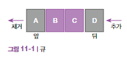
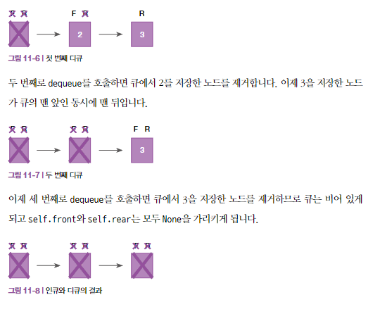

# 큐
- 뒤에서부터 요소를 추가하고 앞에서부터 요소를 꺼내는 선형 자료구조
    - 선입 선출 자료구조 (FIFO) : 가장 먼저 추가한 요소부터 제거하는 자료구조
    - 접근이 제한된 자료구조

    


- 동작
- `인큐` : 요소를 큐의 뒷부분에 추가
- `디큐` : 요소를 큐의 앞부분에서 제거

    

- 종류
- 제한적 큐: 추가할 수 있는 요소의 수에 제한이 있는 큐
    - 배열, 링크드리스트(저장하는 요소의 개수 추적)을 사용해 만듦
- 무제한 큐 : 추가할 수 있는 요소의 수에 제한이 없는 큐
    - 링크드 리스트를 사용해 만듦

### 사용해야 할 때
- 인큐와 디큐는 모두 큐의 크기에 관계없이 `O(1)`
-  탐색은 비효율적
    - 특정 요소를 찾기 위해 요소 전체를 순회해야 함
    - 탐색 작업은 모두 O(n)
- 프로그래밍에 유용함
    - 순서대로 입출력하는 상황에 이상적인 자료구조
    - 네트워크 패킷 송수신, 웹서버에 들어오는 요청 처리 등

### 큐 만들기
- 링크드 리스트를 사용해 Queue 클래스 만들기
```python
class Node:
    def __init__(self, data, next=None):
        self.data = data
        self.next = next

class Queue:
    def __init__(self):
        self.front = None
        self.rear = None
        self._size = 0

    def enqueue(self, item):
        self._size += 1
        node = Node(item)
        if self.rear is None:
            self.front = node
            self.rear = node
        else:
            self.rear.next = node
            self.rear = node

    def dequeue(self):
        if self.front is None:
            raise IndexError('pop from empty queue')
        self._size -= 1
        temp = self.front
        self.front = self.front.next
        if self.front is None:
            self.rear = None
        return temp.data

    def size(self):
        return self._size

```



### 두 개의 스택을 사용해 큐 만들기
```python
class Queue:
    def __init__(self):
        self.s1 = []
        self.s2 = []

    def enqueue(self, item):
        while len(self.s1) != 0:
            self.s2.append(self.s1.pop())
        self.s1.append(item)
        while len(self.s2) != 0:
            self.s1.append(self.s2.pop())

    def dequeue(self):
        if len(self.s1) == 0:
            raise Exception("Cannot pop from empty queue")
        return self.s1.pop()
# 인큐 : O(n)
# 디큐 : O(1)
```