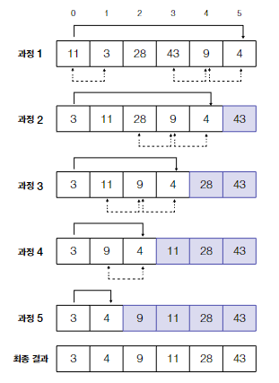
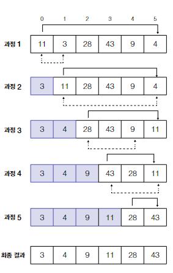

# 정렬 알고리즘
- 데이터 정렬 : 데이터를 일정한 순서로 배치하는 것
- 제자리 정렬 : 정렬할 항목의 수에 비해 아주 작은 저장 공간을 더 사용하는 정렬 알고리즘
- 안정적 정렬 : 데이터 요소의 상대적인 순서를 보존
  - 데이터의 두 항목이 크기가 같을 때, 정렬 전의 위치 상태를 똑같이 유지
## 버블 정렬
- 숫자 리스트를 순회하면서 각 숫자를 다음 숫자와 비교하고, 순서가 올바르지 않으면 둘의 위치를 바꾸는 정렬 알고리즘
- 액체 속 공기 방울이 올라가는 것처럼 보인다고 버블 정렬 이름이 붙음

  

```python
def bubble_sort(a_list):
    list_length = len(a_list) - 1
    for i in range(list_length):
        no_swaps = True
        for j in range(list_length):
            if a_list[j] > a_list[j + 1]:
                a_list[j], a_list[j + 1] = a_list[j + 1], a_list[j]
                no_swaps = False
        if(no_swap)
                  return a_list
    return a_list
```
- 내부 루프만 있다면 리스트는 완전히 정렬되지 않음
### 사용해야 할 때
- 알고리즘이 단순함
- `O(n**2)`
- 데이터 세트가 크면 효율적인 선택이 아님
- `안정적인 정렬` : 정렬 기준 이외의 요인 때문에 리스트의 순서가 바뀌지 않음

## 삽입 정렬
- 카드 묶음을 정렬하는 것과 비슷한 알고리즘. 배열 맨 처음 정렬된 부분에, 정렬되지 않은 다음 항목을 반복적으로 삽입하는 방식
  - 카드 묶음을 둘로 나누기 (왼쪽, 오른쪽)
  - 왼쪽에는 정렬된 카드 | 오른쪽에는 정렬되지 않은 카드
  - 오른쪽에 있는 카드를 하나씩 꺼내 정렬 규칙에 따라 왼쪽에 정렬된 카드들 사이에 삽입

  

```python
def insertion_sort(a_list):
    for i in range(1, len(a_list)):
        value = a_list[i]
        while i > 0 and a_list[i - 1] > value:
            a_list[i] = a_list[i - 1]
            i = i - 1
        a_list[i] = value
    return a_list

```
### 사용해야 할 때
- `O(n**2)`
- 버블복잡도와 시간복잡도가 같으나, 버블보다는 효율적일 가능성이 있음
  - 정렬되어 있거나 거의 정렬된 리스트에서 삽입 정렬의 시간 복잡도는 O(n)으로 효율적.
  - 미리 정렬된 리스트에 새 항목을 추가할 때 좋음
## 병합 정렬
- 리스트를 계속해서 반으로 나눠 요소가 한 개 뿐인 리스트로만 남았을 때, 이들을 올바른 순서대로 다시 합치는 재귀 정렬 알고리즘
  - (1) 리스트가 한 개의 숫자로만 이뤄진 서브 리스트들로 나뉠 때까지 분할을 계속함
  - (2) 요소가 하나만 있는 정렬된 리스트들의 첫번째 요소를 비교하여 하나씩 병합
  - (3) 더 작은 숫자를 새로 병합된 리스트의 처음 위치에 놓음
  - (4) (2),(3) 반복

  
```python
def merge_sort(a_list):
    if len(a_list) > 1:
        mid = len(a_list) // 2
        left_half = a_list[:mid]
        right_half = a_list[mid:]

        merge_sort(left_half)
        merge_sort(right_half)

        left_ind = 0
        right_ind = 0
        alist_ind = 0

        while left_ind < len(left_half) and right_ind < len(right_half):
            if left_half[left_ind] <= right_half[right_ind]:
                a_list[alist_ind] = left_half[left_ind]
                left_ind += 1
            else:
                a_list[alist_ind] = right_half[right_ind]
                right_ind += 1
            alist_ind += 1

        while left_ind < len(left_half):
            a_list[alist_ind] = left_half[left_ind]
            left_ind += 1
            alist_ind += 1

        while right_ind < len(right_half):
            a_list[alist_ind] = right_half[right_ind]
            right_ind += 1
            alist_ind += 1

    return a_list

# Example usage
a_list = [54,26,93,17,77,31,44,55,20]
print(merge_sort(a_list))

```
### 사용해야 할 때
- 분할 정복 알고리즘의 한 예
  - 재귀를 통해 문제를 두 개 이상의 더 작은 문제로 분할하여 각각의 작은 문제들이 해결될때까지 나누기를 반복하는 알고리즘
- 최악/최선/평균일 때 `O(n log n)`
  - 리스트를 서브 리스트로 분할하는 단계는 로그 함수를 따르고, 서브 리스트를 병합하는 단계는 요소의 개수에 비례하는 선형시간을 따름
- 효율적인 정렬 알고리즘 중 하나로 널리 사용 중
- 안정적인 정렬 알고리즘 중 하나
- 데이터가 너무 커서 메모리에 넣지 못할 때 좋은 선택
  - 메모리에서 정렬할 수 있을만큼 작아질때 까지 별도의 파일로 디스크에 쓸 수있음

## 선택 정렬
  - (1) 리스트에서 가장 작거나 큰 항목을 찾아서 첫번째 항목과 위치를 바꿈
  - (2) 그 다음 항목을 찾아서 두번째 항목과 위치를 바꿈
  - (3) (1), (2) 반복
- 리스트가 이미 정렬되어 있어도 시간복잡도는 O(n^2)
- 안정적이지도 않음

  

```python
def selection_sort(seq):
    length = len(seq)
    for i in range(length - 1):
        min_j = i
        for j in range(i + 1, length):
            if seq[min_j] > seq[j]:
                min_j = j
        seq[i], seq[min_j] = seq[min_j], seq[i]
    return seq

def test_selection_sort():
    seq = [11, 3, 28, 43, 9, 4]
    assert(selection_sort(seq) == sorted(seq))
    print("테스트 통과!")

if __name__ == "__main__":
    test_selection_sort()

```

## 놈 정렬
- 앞으로 이동하며 잘못 정렬된 값을 찾은 후, 올바른 위치로 값을 교환하며 다시 뒤로 이동하는 정렬
- 최선의 경우 시간복잡도 O(n), 평균과 최악의 경우 O(n^2)인 정렬 알고리즘

  

```python
def gnome_sort(seq):
    i = 0
    while i < len(seq):
        if i == 0 or seq[i - 1] <= seq[i]:
            i += 1
        else:
            seq[i], seq[i - 1] = seq[i - 1], seq[i]
            i -= 1
    return seq

def test_gnome_sort():
    seq = [5, 3, 2, 4]
    assert(gnome_sort(seq) == sorted(seq))
    print("테스트 통과!")

if __name__ == "__main__":
    test_gnome_sort()
```

## 카운트 정렬
- 숫자의 발생 횟수를 계산하는 누적 카운트 사용
  - 누적 카운트를 갱신하여 순서대로 숫자를 직접 배치하는 방식
- 작은 범위의 정수를 정렬할 때 유용함
- 각 숫자 간의 간격이 크다면, 로그 선형 제한이 걸리며 비효율적이 됨
- 숫자 간격이 크지 않다면, 시간복잡도는 선형인 O(n+k)
- 여러 값이 동일한 키를 갖는 경우에도 원래 키의 순서를 가지므로 안적적인 정렬
```python
from collections import defaultdict

def count_sort_dict(a):
    b, c = [], defaultdict(list)
    for x in a:
        c[x].append(x)
    for k in range(min(c), max(c) + 1):
        b.extend(c[k])
    return b

def test_count_sort():
    seq = [3, 5, 2, 6, 8, 1, 0, 3, 5, 6, 2, 4, 1, 5, 3]
    assert(count_sort_dict(seq) == sorted(seq))
    print("테스트 통과!")

if __name__ == "__main__":
    test_count_sort()

```
## 퀵 정렬
- 피벗값을 잘 선택하는 것이 성능의 핵심
- 피벗 : 리스트에서 기준이 되는 하나의 요소

- 피벗 앞에는 피벗보다 작은 값이 오고, 피벗 뒤에는 피벗보다 
- 분할 과정에서 n-1 요소의 영역을 생성하는 경우 
  - 최악의 경우 시간복잡도(O(n^2))
  - 최선의 경우 두 개의 n/2 크기 리스트 생성. 최선/평균 시간복잡도는 O(n log n)

  
  

```python
def quick_sort_cache(seq):
    """
    1) 한 함수로 구현한다(캐시 사용).
    """
    if len(seq) < 2:
        return seq
    ipivot = len(seq) // 2  # 피벗 인덱스
    pivot = seq[ipivot]  # 피벗

    before = [x for i, x in enumerate(seq) if x <= pivot and i != ipivot]
    after = [x for i, x in enumerate(seq) if x > pivot and i != ipivot]

    return quick_sort_cache(before) + [pivot] + quick_sort_cache(after)

def partition_devided(seq):
    """
    2) 1)의 퀵 정렬을 두 함수로 나누어 구현한다(캐시 사용).
    """
    pivot, seq = seq[0], seq[1:]
    before = [x for x in seq if x <= pivot]
    after = [x for x in seq if x > pivot]
    return before, pivot, after

def quick_sort_cache_devided(seq):
    if len(seq) < 2:
        return seq
    before, pivot, after = partition_devided(seq)
    return quick_sort_cache_devided(before) + [pivot] + quick_sort_cache_devided(after)

def partition(seq, start, end):
    """
    3) 두 함수로 나누어서 구현한다(캐시 사용 안 함).
    """
    pivot = seq[start]
    left = start + 1
    right = end
    done = False
    while not done:
        while left <= right and seq[left] <= pivot:
            left += 1
        while left <= right and pivot < seq[right]:
            right -= 1
        if right < left:
            done = True
        else:
            seq[left], seq[right] = seq[right], seq[left]
    seq[start], seq[right] = seq[right], seq[start]
    return right

def quick_sort(seq, start, end):
    if start < end:
        p = partition(seq, start, end)
        quick_sort(seq, start, p - 1)
        quick_sort(seq, p + 1, end)
    return seq

def test_quick_sort():
    seq = [3, 5, 2, 6, 8, 1, 0, 3, 5, 6, 2]
    assert(quick_sort_cache(seq) == sorted(seq))
    assert(quick_sort_cache_devided(seq) == sorted(seq))
    assert(quick_sort(seq, 0, len(seq)-1) == sorted(seq))
    print("테스트 통과!")

if __name__ == "__main__":
    test_quick_sort()

```


## 힙 정렬
- 정렬되지 않은 영역이 힙이라는 점을 제외하면 선택 정렬과 비슷함
- 로그 선형의 시간복잡도를 가짐

## 파이썬의 정렬 알고리즘
### 팀 정렬
- `하이브리드 정렬 알고리즘`
  - 문제를 해결하는데 두 개 이상의 알고리즘을 결합한 알고리즘
- 삽입 정렬과 병합 정렬을 결합하여 만든 효율적인 알고리즘
- sorted 함수
  - 리스트, 문자열 리스트에도 사용 가능
- sort 함수
  - 리스트에만 사용
  - 새로운 리스트를 반환하지 않고, 원래 리스트를 수정

### 시간복잡도 비교

