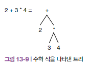

# 이진 탐색
- 리스트에서 숫자 탐색할 때 이용
    - 탐색하고자 하는 리스트를 1/2로 줄여나가는 방식
- 데이터가 정렬된 상태일 때만 사용 가능
- 탐색 방법
    1. 중앙값 찾기
    2. 찾는 숫자가 중앙값보다 큰지 작은지 판단
    3. 숫자를 찾을 때까지 1과 2를 방복
- 중앙값을 찾기 위한 선형 선택 과정이 필요X
    - 이진 탐색은 애초에 정렬된 데이터를 대상으로 수행
- 시간 복잡도 : O(log n)
    - ex)
        - 100개의 숫자가 들어있는 리스트의 이진탐색은 100 / 2**x < 1
        - 2^x = 100 숫자를 구하기 -> log 100 -> log N
    - 이진 탐색의 실행시간을 나타내는 로그의 밑은 2이지만, 로그에 상수를 곱해서 밑을 변경할 수 있으므로 빅 O 표기법에서 로그는 중요하지 않음!
- 데이터가 정렬되어 있지 않다면, 정렬에 시간이 걸리더라도 정렬 후 이진탐색을 사용하는게 더 나음
    -> 여러번 탐색할 계획이면, 한 번 정렬한 후 모든 탐색의 속도를 향상시키는 것을 고려할 것


```py
def binary_search(a_list, n):
    first = 0
    last = len(a_list) - 1
    while last >= first:
        mid = (first + last) // 2
        if a_list[mid] == n:
            return True
        if n < alist[mid]:
            last = mid - 1
        else:
            first = mid +1
    return False
    
```

# 이진 트리
## 트리
- 비선형 자료구조
- 노드를 연결해 계층 구조를 만듦
- 기본 동작
    - 삽입
    - 탐색
    - 삭제

### 트리의 노드
- 루트 노드 : 트리의 맨 앞에 있는 노드
- 자식 노드 : 루트노드 아래에 연결된 링크드 노드
- 부모 노드 : 하나 이상의 자식 노드를 가지는 노드
- 형제 노드 : 같은 부모 노드를 공유
- 에지(Edge) : 두 노드 사이의 연결
- 리프 노드 : 자식 노드가 없는 노드
- 브랜치 노드 : 자식 노드가 있는 노드

## 이진 트리
- 각각의 노드가 최대 두개의 자식 노드만 가질 수 있는 트리 자료 구조

## 이진 탐색 트리
- 각각의 노드가 최대 두 개의 자식만 가질 수 있음
- 각 노드의 값이 왼쪽에 있는 서브트리의 어떤 값보다 크고, 오른쪽 서브트리에 있는 어떤 값보다 작도록 정렬하여 저장하는 트리 자료구조
- 중복값을 저장할 수 없음
    - 동일한 값에 대한 발생 횟수 추적을 위해 트리의 노드 객체에 카운트 필드를 추가하여 제한 우회 및 중복값 처리 가능
- 트리의 이동
    - 백트래킹이 필요한 경우가 많음

## 트리를 사용해야 할 때
- 로그 함수를 따르지만, 해시 테이블도 실행 시간이 느린데 왜 사용할까?
1. 계층적 정보를 저장할 수 있음
2. 메모리 사용량이 적음
    - 해시 테이블은 충돌로 인해 실제 저장하는 데이터보다 열 배 이상의 공간을 사용할 수도 있음
3. 데이터의 정렬된 순서나 역순으로 빠르게 이동할 수 있음
    - 해시 테이블은 데이터를 순서대로 저장하지 않으므로 순서에 이동하는 것이 불가능함

- HTML, XML도 태그를 중첩할 수 있어서, 트리로 표현하고, 각 노드는 HTML이나 XML의 요소를 나타냄
- 문서객체모델(DOM) : XML이나 HTML 문서를 트리로 나타내는 언어 독립적 인터페이스

- 산술 표현식 역시 트리 형태로 분석 가능
    - 파스 트리 : 표현식 평가 규칙과 같은 일정한 문법에 따라 데이터를 저장하는 정렬된 트리


## 이진 트리 만들기
```py
class BinaryTree:
    def __init__(self, value):
        self.key = value
        self.left_child = None
        self.right_child = None
    
    def insert_left(self, value):
        if self.left_child == None:
            self.left_child = BinaryTree(value)
        else: # 왼쪽 서브트리를 한단계씩 밀어냄
            bin_tree = BinaryTree(value)
            bin_tree.left_child = self.right_child
            bin_tree.left_child = bin_tree
    
    def insert_right(self, value):
        if self.right_child == None:
            self.right_child = BinaryTree(value)
        else:
            bin_tree = BinaryTree(value)
            bin_tree.right_child = self_right_child
            self.right_child = bin_tree


```
- 모든 자식 노드는 서브트리임
    - 서브트리 : 노드(루트 노드는 제외)와 그 자손 노드
- 서브트리는 다시 서브트리를 가질 수 있음


## 너비 우선 탐색
- 레벨의 순서대로 모든 노드에 방문하는 방법
- 트리 루트(레벨0)에서 시작해 각 레벨의 모든 노드를 하나씩 방문하며 마지막 레벨에 도달할 때까지 단계 반복

- 현지 리스트의 노드를 방문할 때마다 찾으려는 데이터와 일치하는지 확인하고, 그 자식 노드를 '다음'리스트에 추가, 현재 레벨을 모두 방문해 다음 레벨로 이동할 때는 리스트 교체
```py
def breadth_first_search(self, n):
    current = [self]
    next = []
    while current :
        for node in current :
            if node.key ==n:
                return True
            if node.left_child:
                next.append(node.left_child)
            if node.right_child:
                next.append(node.right_child)
        current = next
        next = []
    return False
```
- return True가 아닌 찾은 노드를 반환하면 이진 트리를 만드는 코드로 변환 가능

## 다른 트리 이동 방법
- 깊이 우선 이동 : 이진 트리의 모든 노드를 한 방향으로 방문한 후 다음 형제 노드로 이동
### 전위 이동
```py
def preorder(tree):
    if tree:
        print(tree.key)
        preorder(tree.left_child)
        preorder(tree.right_child)
```


### 후위 이동
```py
def postorder(tree):
    if tree:
        postorder(tree.left_child)
        preorder(tree.right_child)
        print(tree.key)
```


### 중위 이동
```py
def inorder(tree):
    if tree:
        inorder(tree.left_child)
        print(tree.key)
        inorder(tree.right_child)
```


## 이진 트리 뒤집기
- 이진 트리 반전 : 모든 노드를 서로 바꾸는 것
- 너비 우선 탐색을 사용해 왼쪽과 오른쪽 자식을 각자 추적해 뒤집는 것
```py
def inver(self):
    current = [self]
    next = []
    while current:
        for node in current :
            if node.left_child:
                next.append(node.left_child)
            if node.right_child:
                next.append(node.right_child)
            tmp = node.left_child
            node_left_child = node.right_child
            node_right_child = tmp
        current = next
        next = []
```
# 이진 탐색 트리
- 노드를 정렬된 순서로 유지하는 자료구조
    - 이진 트리로 이루어지며, 각 노드에는 값과 두 자식 노드에 대한 포인터가 있음
    - 노드의 왼쪽 하위 트리에는 노드의 값보다 작은 값의 노드만 존재함
    - 노드의 오른쪽 하위 트리에는 노드의 값보다 큰 값의 노드만 존재함
    - 왼쪽과 오른쪽 하위 트리 모두 이진 탐색 트리여야 함
    - 중복 노드가 없어야 함
## 자가 균형 이진 탐색 트리
- 균형 트리 : 모든 하위 트리의 높이 차이가 1 이하인 트리
- 편향 트리 : 균형이 유지되지 않은 한쪽으로 치우친 편향 트리
- 자가 균형 이진 탐색 트리 : 트리에서 노드의 삽입과 삭제 같은 연산이 일어날 때 자동으로 균형 트리를 유지하는 이진 탐색 트리
    - 시간복잡도 O(logn)
- 균형도 : 왼쪽과 오른쪽 하위 트리의 높이 차이
- 균형 조정 방법
    - 노드 분할 및 병합 : 노드의 자식은 두 개를 초과하지 못함. 노드가 많으면, 두 개의 하위 노드로 나눔
    - 노드 회전 : 간선을 전환함. x가 y의 부모이면

## AVL 트리
- 삽입과 삭제 시 자동으로 트리를 균형 있게 유지하는 특성을 가지고 있음
- 트리에 노드를 추가 또는 삭제할 때마다 이진 탐색 트리 클래스에 자가 균형 조정 메서드를 호출하여 추가해서 구현
- 노드가 추가 또는 삭제될 때마다 트리의 높이를 계속 확인하여 동작함
- 트리의 균형도를 맞추기 위해 오른쪽 또는 왼쪽으로 회전함
## 레드-블랙 트리
- 이진 검색 트리의 한 종류로서, 균형을 유지하는 특수 규칙을 통해 효율적인 삽입, 삭제 및 검색을 지원함
- 색상 규칙: 노드는 레드(red) 또는 블랙(black) 중 하나의 색을 가짐.
- 규칙
    - 모든 노드는 레드 또는 블랙이다.
    - 루트 노드는 블랙이다.
    - 모든 리프(NIL) 노드는 블랙이다.
    - 레드 노드의 자식은 모두 블랙이다(즉, 두 레드 노드가 연속으로 나타날 수 없다).
    - 임의의 노드에서 그 자손인 리프 노드에 이르는 모든 경로에는 같은 수의 블랙 노드가 포함된다.
- 재균형: 삽입 및 삭제 시 규칙을 위반하는 경우, 색상 변경과 회전을 통해 균형을 유지함.
- 장점: 최악의 경우에도 O(log n)의 시간 복잡도를 보장함.


## 질문
### 해시테이블이 아닌 트리를 사용하는 이유는 뭘까?
1. 계층적 정보를 저장할 수 있음
2. 메모리 사용량이 적음
    - 해시 테이블은 충돌로 인해 실제 저장하는 데이터보다 열 배 이상의 공간을 사용할 수도 있음
3. 데이터의 정렬된 순서나 역순으로 빠르게 이동할 수 있음
    - 해시 테이블은 데이터를 순서대로 저장하지 않으므로 순서에 이동하는 것이 불가능함

## 이진 트리를 뒤집어 보세요.

## 이진 검색 트리의 삽입, 삭제, 검색의 시간 복잡도는 무엇인가요?
## AVL 트리의 회전 연산에 대해 설명하세요.
## 레드블랙 트리에서 레드 노드의 자식 노드가 항상 블랙이어야 하는 이유는 무엇인가요?
## 이진 검색 트리와 AVL 트리, 레드블랙 트리의 차이점은 무엇인가요?
## AVL 트리와 레드블랙 트리 중에서 어떤 트리가 더 빠르게 균형을 유지할 수 있나요? 그 이유는 무엇인가요?
# AVL트리를 사용하는 이유