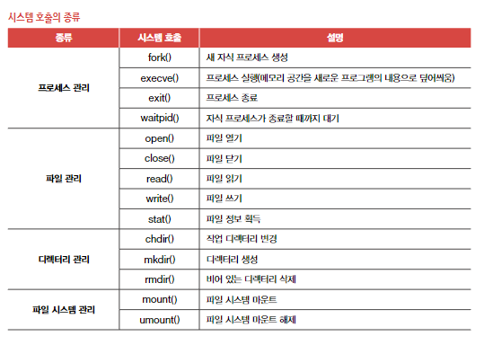

# 9-1. 운영체제를 알아야 하는 이유

## 운영체제란

- 시스템 자원 : 프로그램 실행에 마땅히 필요한 요소
- 운영체제 : 실행할 프로그램에 필요한 자원을 할당하고, 프로그램이 올바르게 실행되도록 돕는 프로그램
  - 운영체제는 메모리 내 커널 영역어 적재되어 실행됨.
  - 사용자가 이용하는 응용 프로그램이 적재되는 영역은 사용자 영역.
  - => 운영체제는 커널 영역에 적재되어 사용자 영역에 적재된 프로그램들에 자원을 할당하고, 이들이 올바르게 실행되도록 도움.
- 운영체제를 배움으로써 문제 해결의 실마리를 찾을 수 있음

# 9-2. 운영체제의 큰 그림

## 커널

- 커널 (kernel) : 운영체제의 핵심 기능을 담당함
- 사용자 인터페이스(User Interface) : 사용자가 컴퓨터와 상호작용할 수 있는 통로
  - 그래픽 유저 인터페이스 (Graphical User Interface) : 그래픽 기반
  - 커맨드 라인 인터페이스 (Command Line Interface) : 명령어 기반

## 이중 모드와 시스템 호출

- 운영체제는 프로그램들이 자원에 접근하려고할 때 오직 자신을 통해서만 접근하도록 하여 자원을 보호함(문지기 역할)

### 이중 모드

- CPU가 명령어를 실행하는 모드를 사용자 모드와 커널 모드로 구분하는 방식
- 사용자 모드 : 운영체제 서비스를 제공받을 수 없는 실행 모드. 커널 영역의 코드를 실행할 수 없는 코드
- 커널 모드 : 운영체제 서비스를 제공받을 수 있는 실행 모드. 커널 영역의 코드를 실행할 수 있는 모드
  > CPU가 사용자 모드로 실행 중인지, 커널 모드로 실행중인지는 플래그 레지스터 속 슈퍼바이저 플래그를 보면 알 수 있음

### 시스템 호출(system call)

- 사용자 모드로 실행되는 프로그램이 자원에 접근하는 운영체제 서비스를 제공받기 위해 커널 모드로 전환하는 방법
- 소프트웨어적 인터럽트임
- CPU가 시스템 호출을 처리하는 순서
  1. 시스템 호출을 발생시키는 명령어 실행
  2. CPU는 지금까지의 작업을 백업합
  3. 커널 영역 내에 시스템 호출을 수행하는 코드를 실행(인터럽트 서비스 루틴)
  4. 기존에 실행하던 응용프로그램으로 복귀하여 실행을 계속함

## 운영체제의 핵심 서비스

### 프로세스 관리

- 프로세스 : 실행 중인 프로그램

### 자원 접근 및 할당

- CPU : CPU 스케줄링
  - 일반적으로 메모리에는 여러 프로세스가 적재되고, 하나의 CPU는 한 번에 하나의 프로세스만 실행할 수 있음. 그래서 하나의 프로세스가 CPU를 이용하고 있다면 다른 프로세스는 기다려야함 -> 공정하게 PCU를 할당하기 위해 운영체제가 결정하는 것

### 메모리

- 운영체제는 새로운 프로세스가 적재될 때마다 어느 주소에 적재해야 할지를 결정해야 함

### 입출력장치

- 입출력장치가 발생시키는 하드웨어 인터럽트를 추러하기 위해 커널 영역에 있는 인터럽트 서비스 루틴을 실행함(운영체제는 인터럽트 서비스 루틴을 제공함으로써 입출력 작업을 수행)

### 파일 시스템 관리

> 가상 머신 : 소프트웨어적으로 만들어낸 가상 컴퓨터

## 시스템 호출의 종류

# CS 질문

## OS(운영체제)가 무엇인지 설명해주실 수 있나요?

- 운영체제는 하드웨어 자원을 관리하고, 응용 프로그램와 하드웨어 사이를 중재하는 인터페이스를 의미합니다.

* 인터페이스 : 서로 다른 두 개의 시스템 사이에서 정보나 신호를 주고 받는 접점이나 경계를 의미

## 운영 체제의 주요 목적은 무엇입니까?

1. 컴퓨터 시스템의 계산 활동을 관리하여 컴퓨터 시스템이 제대로 작동하도록 한다.
2. 프로그램 개발 및 실행을 위한 환경을 제공한다.

## 커널이 무엇인지 설명하실 수 있나요?

- 기본적으로 프로그램이 실행되기 위해서는 주기억장치에 적재된 상태여야 합니다.
- 운영체제 역시 프로그램이기 때문에 메인 메모리에 적재가 되어야 하나, 운영체제의 크기가 너무 커서 전체를 다 메인 메모리에 올리게 된다면 비효율적입니다. (메모리 공간의 낭비)
- 따라서 커널(kernel)이라고 하는 항상 필요한 운영체제의 핵심 부분만을 메인 메모리에 적재하여 운영체제를 사용하게끔 합니다.
- 즉, 커널은 메모리에 상주하는 운영체제의 핵심 부분이라고 할 수 있습니다.

## System Call은 무엇인가요?

- System Call(시스템 콜)은 사용자나 응용프로그램이 커널에서 제공하는 기능을 사용하기 위한 인터페이스입니다.
- 운영체제는 커널이 제공하는 서비스를 '시스템 콜'을 사용해야만 사용할 수 있도록 제한함으로써 컴퓨터 자원을 보호하면서 사용자나 응용프로그램에게 서비스를 제공할 수 있습니다.
