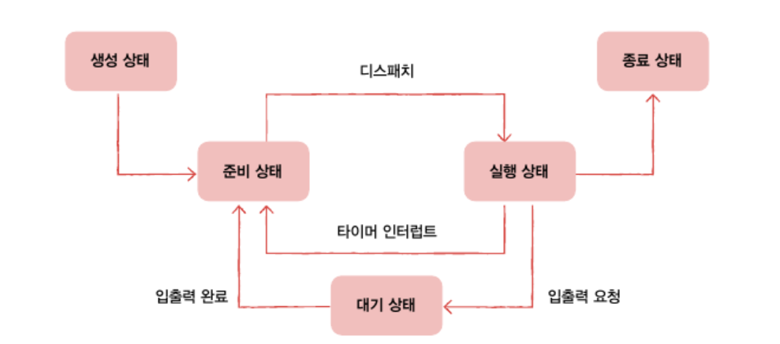

# 10-1. 프로세스 개요

- 프로세스 : 실행중인 프로그램
- 보조기억 장치에 저장된 프로그램을 메모리에 적재하고 실행하는 순간 그 프로그램은 프로세스가 됨
- 포그라운드 프로세스(foreground process) : 사용자가 보는 앞에서 실행되는 프로세스
- 백그라운드 프로세스(background process) : 사용자가 보지 못하는 뒤편에서 실행
- 서비스 : 사용자와 상호작용하지 않고, 정해진 일만 수행하는 백그라운드 프로세스, 유닉스 체제에서는 데몬이라고 부름

## 프로세스 제어 블록

> 모든 프로세스는 실행을 위해 CPU를 필요로 하지만, CPU 자원은 한정적임

> 프로세스들은 돌아가며 한정된 시간만큼만 CPU를 이용함 -> 타이머 인터럽트가 발생하면 자신의 차례를 양보하고, 다음 차례가 올 때까지 기다림

> 운영체제는 번갈아 수행되는 프로세스의 실행 순서를 관리하고, 프로세스에 CPU를 비롯한 자원을 배분함. 이 역할을 수행하는게 PCB

- PCB : 프로세스와 관련된 정보를 저장하는 자료 구조

### 특징

- PCB는 커널 영역에 생성됨
- 프로세스 생성 시에 만들어지고 실행이 끝나면 폐기함
  - 새로운 프로세스가 생성되었다 = 운영체제가 PCB를 생성했다.
  - 프로세스가 종료되었다 = 운영체제가 해당 PCB를 폐기했다

### PCB에 담기는 정보

- 프로세스ID
  - PID라고 하며, 특정 프로세스를 식별하기 위해 부여하는 고유 번호
  - 같은 일을 수행하는 프로그램이라고 해도, 두 번 실행하면, PID가 다른 두 개의 프로세스가 실행됨
- 레지스터 값
  - 프로세스는 자신의 실행 차례가 돌아오면 이전까지 사용했던 레지스터의 중간값들을 모두 복원함
  - PCB 안에는 해당 프로세스가 실행하며 사용했던 레지스터 값들이 담김
- 프로세스 상태
- CPU 스케줄링 정보
- 메모리 관리 정보
  - 프로세스가 어느 주소에 저장되어 있는지에 대한 정보
  - 베이스 레지스터, 한계 레지스터 값, 페이지 테이블 정보
- 사용한 파일과 입출력 장치 목록

## 문맥 교환

- 하나의 프로세스에서 다른 프로세스로 실행 순서가 넘어가면 -> 지금까지의 중간 정보를 백업함
- 문맥 : 중간 정보, 하나의 프로세스 수행을 재개하기 위해 기억해야할 정보
  - PCB에 기록되는 정보들은 문맥임
- 인터럽트가 발생하면, 운영체제는 해당 프로세스의 PCB를 문맥에 백업 -> 뒤이어 실행할 프로세스B의 문맥을 복구함 => 자연스럽게 실행되는 프로세스가 바뀜
- 문맥 교환 : 기존 프로셋의 문맥을 PCB에 백업하고, 새로운 프로세스를 실행하기 위해 문맥을 PCB로부터 복구하여 새로운 프로세스를 실행하는 것
  > 문맥 교환을 너무 자주 하면 오버헤드가 발생할 수 있음

## 프로세스의 메모리 영역

사용자 영역에 프로세스가 어떻게 배치되는가

### 코드 영역

- 텍스트 영역
- 실행할 수 있는 코드(기계어로 이루어진 명령어) 저장
- CPU가 실행할 명령어가 담겨 있기에 쓰기 금지, 읽기 전용 공간

### 데이터 영역

- 프로그램이 실행되는 동안 유지해야할 데이터 저장

  - ex : 전역 변수 (프로그램이 실행되는 동안 유지되며, 프로그램 전체에 접근할 수 있는 변수)

- 코드 영역과 데이터 영역은 프로그램은 크기가 변하지 않음
  - 프로세스를 구성할 명령어가 바뀔 일도 없고, 데이터 영역에 저장될 내용은 프로그램 실행동안 유지될 데이터임
  - 정적 할당 영역이라고 부름
- 힙 영역과 스택 영역은 프로세스 실행과정에서 크기가 변할 수 있음
  - 동적 할당 영역

### 힙 영역

- 프로그래머가 직접 할당할 수 있는 저장공간
- 언젠가 메모리 공간을 반환해야함 (더 이상 해당 메모리 공간을 사용하지 않겠다고 선언)
- 메모리 누수 : 메모리 공간을 반환하지 않을 시, 할당한 공간이 계속 남아 메모리 낭비를 초래하는 것

### 스택 영역

- 데이터를 일시적으로 저장하는 공간
  - ex: 매개변수, 지역변수
- 실시간으로 크기가 변할 수 있으므로 동적 할당 영역
- 일반적으로 스택영역은 높은 주소에서 낮은 주소로, 힙 영역은 낮은주소에서 높은 주소로 할당이 되어, 새로 할당되는 주소가 겹칠일이 없도록 함

# 10-2 프로세스 상태와 계층 구조

## 프로세스 상태

- 생성 상태 : 프로세스를 생성 중인 상태
- 준비 상태 : 당장이라도 CPU에 할당받아 실행할 수 있지만, 아직 자신의 차례가 아니라 기다리는 상태
- 실행 상태 : CPU를 할당받아 실행 중인 상태. 프로세스가 할당된 시간을 모두 사용하면 다시 준비 상태가 됨. 실행 도중 입출력장치를 사용하여 입출력 장치가 끝날 때까지 기다려야 한다면 대기 상태가 됨.
- 대기 상태 : 특정 이벤트가 일어나길 기다리는 상태. 대표적으로 입출력 장치의 작업을 기다리는 상태
- 종료 상태 : 프로세스가 종료된 상태. 운영체제는 PCB와 프로세스가 사용한 메모리를 정리함
- 프로세스 상태 다이어그램
  

## 프로세스 계층 구조

- 프로세스 실행 도중 시스템 호출을 통해 다른 프로세스를 생성할 수 있음
  - 부모 프로세스 : 새 프로세스를 생성한 프로세스
  - 자식 프로세스 : 부모 프로세스에 의해 생성됨
- 일부 운영체제에서는 자식 프로세스의 PCB에 부모 프로세스의 PID인 PPID(Parent PID)를 기록함

## 프로세스 생성 기법

- fork : 자신의 복사본을 자식 프로세스에 생성 (복사)
  - 부모 프로세스의 자원들이 상속됨. PID나 저장된 메모리 위치는 다름
- exec : 자신의 메모리 공간을 다른 프로그램을 교체 (새로운 프로그램 내용으로 전환하여 실행하는 시스템 호출) (옷 갈아입기)
  - 코드 영역과 데이터 영역의 내용이 실행할 프로그램의 내용으로 바뀌고, 나머지 영역은 초기화됨.
  - exec을 하지 않으면, 부모 프로세스와 자식 프로세스는 같은 코드를 병행하여 실행함

# 10-3. 스레드

- 스레드 : 실행의 단위. 프로세스를 구성하는 실행의 흐름 단위.
  - 하나의 프로세스는 여러개의 스레드를 가질 수 있음
  - 스레드를 이용하면, 하나의 프로세스에서 여러 부분을 동시에 실행할 수 있음
- 단일 스레드 프로세스 : 실행의 흐름 단위가 하나
  - 스레드 개념 도입 후, 하나의 프로세스가 여러 일을 동시에 처리할 수 있게됨
- 프로세스의 스레드들은 실행에 필요한 최소한의 정보(프로그램 카운터를 포함한 레지스터, 스택)만을 유지한 채 프로세스 자원을 공유하며 실행됨 (프로세스의 자원을 공유함)
  > 리눅스는 프로세스와 스레드를 크게 구분하지 않음. 프로세스와 스레드 모두 실행의 문맥이라는 점에서 동등하다고 간주하고 태스크라는 이름으로 통일하여 명명.

## 멀티프로세스와 멀티스레드

- 멀티프로세스 : 여러 프로세스를 동시에 실행하는 것
- 멀티스레드 : 여러 스레드로 프로세스를 동시에 실행하는 것
  > 동일한 작업을 수행하는 단일 스레드 프로세스를 여러 개 실행하는 것 vs 하나의 프로세스를 여러 스레드로 실행하는 것
- 프로세스끼리는 기본적으로 자원을 공유하지 않지만, 스레드끼리는 같은 프로세스 내의 자원을 공유함
- 같은 프로세스 내 스레드는 동일한 주소 공간의 코드, 데이터, 힙 영역을 공유하고, 열린 파일과 같은 프로세스 자원을 공유함.
- 멀티 스레드
  - 장점 : 스레드는 프로세스의 자원을 공유하기 때문에 협력과 통신에 유리함, 메모리를 효율적으로 사용할 수 있음
  - 단점 : 하나의 스레드에 문제가 생기면 프로세스 전체에 문제가 생길 수 있음
- 멀티 프로세스
  - 장점 : 하나의 프로세스에 문제가 생겨도 다른 프로세스에는 지장이 적거나 없음
  - 단점 : 같은 프로그램을 실행하기 위해 메모리에 동일한 내용들이 중복해서 존재할 수 있음 -> 메모리 낭비

> 프로세스 간 통신(IPC; inter-Process-Communication)

    - 프로세스간 기본적으로 자원을 공유하진 않지만, 자원을 공유하고 데이터를 주고받을 수 있음
    - 파일을 통한 프로세스 간 통신
    - 공유 메모리 활용
    - 소켓, 파이프 등을 통해 통신

