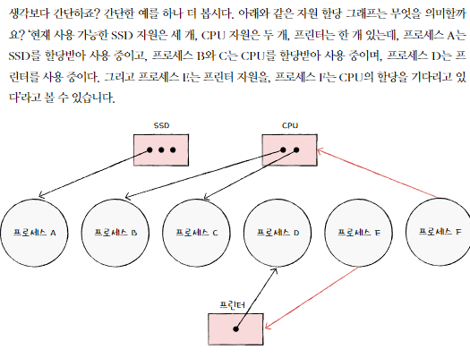
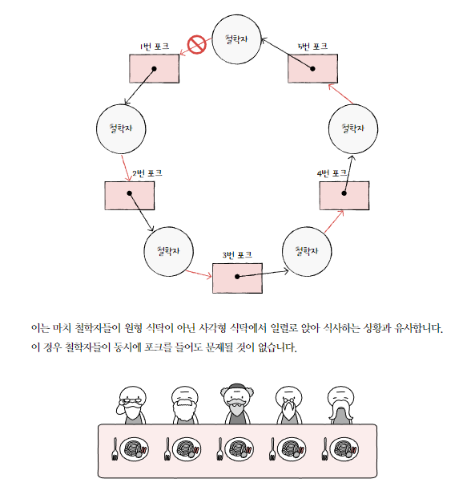
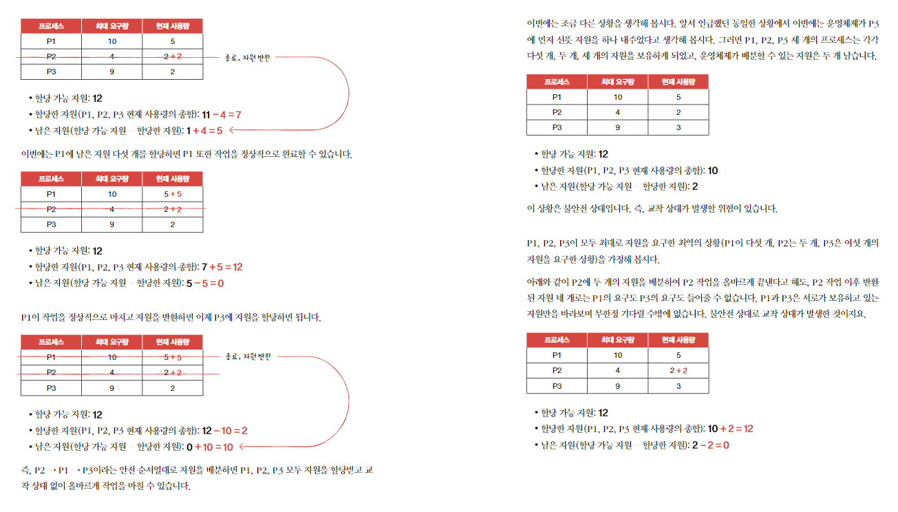

# 13-1 교착상태
## 식사하는 철학자 문제
- 철학자들이 다음의 연속된 과정을 통해 식사를 할 때
1. 일정 시간 생각을 한다.
2. 왼쪽 포크가 사용 가능해질 때까지 대기한다. 만약 사용 가능하다면 집어든다.
3. 오른쪽 포크가 사용 가능해질 때까지 대기한다. 만약 사용 가능하다면 집어든다.
4. 양쪽의 포크를 잡으면 일정 시간만큼 식사를 한다.
5. 오른쪽 포크를 내려놓는다.
6. 왼쪽 포크를 내려놓는다.
7. 다시 1번으로 돌아간다.

- 모든 철학자가 동시에 포크를 집어 식사를 하면 어떤 찰학자도 식사를 할 수 없고 영원히 생각만 하는 상황이 발생함

- 교착 상태 : 일어나지 않을 사건을 기다리며 진행이 멈춰 버리는 현상
- 철학자 : 프로세스 or 스레드
- 포크 : 자원 (포크는 한 번에 하나의 프로세스 혹은 스레드만 접근할 수 있으니 임계 구역이라고 볼 수 있음)
- 생각하는 행위 : 자원을 기다리는 것

## 자원 할당 그래프
- 어떤 프로세스가 어떤 자원을 사용하고 있고, 어떤 프로세스가 어떤 자원을 기다리고 있는 지 표현하는 간단한 그래프

1. 프로세스 = 원, 자원의 종류 = 사각형
2. 사용할 수 있는 자원의 개수는 자원 사각형 내의 점으로 표현
3. 프로세스가 어떤 자원을 할당 받아 사용중이라면 자원에서 프로세스를 향해 화살표를 표시함
4. 프로세스가 어떤 자원을 기다리고 있다면 프로세스에서 자원으로 화살표 표시

- 교착 상태가 발생한 상황은 자원 할당 그래프가 원의 형태를 띔

## 교착 상태 발생 조건
- 상호 배제, 점유와 대기, 비선점, 원형 대기
    - 모든 조건이 만족될 때 교착 상태가 발생할 가능성이 생김
### 상호 배제
- 한 프로세스가 사용하는 자원을 다른 프로세스가 사용할 수 없을 떄
### 점유와 대기
- 어떠한 자원을 할당받은 상태에서 다른 자원을 할당받기를 기다리는 상태
### 비선점
- 그 자원을 이용하는 프로세스의 작업이 끝나야만 비로소 이용할 수 있음(어떤 프로세스도 다른 프로세스의 자원을 강제로 뺴앗지 못함)
### 원형 대기
- 프로세스들과 프로세스 요청 및 할당받은 자원이 원의 형태로 대기하는 것

# 13-2. 교착 상태 해결 방법
- 예방 : 교착 상태 발생 조건에 부합하지 않게 자원을 분배하여 교착 상태를 예방
- 회피 : 교착 상태가 발생하지 않을 정도로 조금씩 자원을 할당하다가 교착상태의 위험이 있다면 자원을 할당하지 않는 방식으로 교착 상태를 회피
- 검출 후 회복 : 자원을 제약 없이 할당하다가 교착 상태가 검출되면 교착 상태를 회복

## 교착 상태 예방
- 상호 배제 없애기
    - 현실에서 사용하기 무리
- 점유와 대기를 없애기
    - 특정 프로세스에 자원을 모두 할당하거나, 아예 할당하지 않는 방식으로 배분
    - 단점
        - 자원의 활용률이 낮아짐 (당장 자원이 필요해도 기다릴 수밖에 없는 프로세스와 사용되지 않으면서 오랫동안 할당되는 자원을 다수 양산)
        - 많은 자원을 사용하는 프로세스가 불리해짐. 자원을 많이 사용하는 프로세스는 적게 사용하는 프로세스에 비해 동시에 자원을 사용할 타이밍을 확보하기 어렵기 떄문임.
- 비선점 조건 없애기
    - 자원을 이용중인 프로세스로부터 해당 자원을 빼앗을 수 있음
    - 단점 : 범용성이 떨어짐 
        - 모든 자원이 이렇게 선점 가능한 것은 아님
        - ex: 한번에 하나의 프로세스만 이용 가능 한프린터 자원
- 원형 대기 조건 없애기
    - 모든 자원에 번호를 붙이고, 오름차순으로 자원 할당
    - 비교적 현실적이고 실용적인 방식이지만 단점이 있음
    
        - 모든 컴퓨터 시스템 내에 존재하는 수많은 자원에 번호를 붙이는 일이 간단한 작업이 아님. 각 자원에 어떤 번호를 붙이는지에 따라 특정 자원의 활용률이 떨어질 수 있음
## 교착 상태 회피
- 교착 상태가 발생하지 않을 정도로만 조심조심 자원을 할당하는 방식
- 교착 상태를 한정된 자원의 무분별한 할당으로 인해 발생하는 문제로 간주함
- 프로세스들에 배분할 수 있는 자원의 양을 고려하여 교착 상태가 발생하지 않을 정도의 양만큼만 자원을 배분하는 방식
### 안전 상태
- 교착 상태가 발생하지 않고 모든 프로세스가 정상적으로 자원을 할당받고 종료될 수 있는 상태
- 안전 순셔열대로 프로세스들에 자원을 배분하여 교착 상태가 발생하지 않는 상태

### 불안전 상태
- 교착 상태가 발생할 수도 있는 상황
- 안전 순서열이 없는 상황
 
### 안전 순서열
- 교착 상태 없이 안전하게 프로세스들에 자원을 할당할 수 있는 순서

## 교착 상태 검출 후 회복
- 교착 상태 발생을 인정하고 사후에 조치하는 방식
- 교착 상태 발생 여부를 주기적으로 검사하고, 검출되면 회복함
### 선점을 통한 회복
- 교착 상태가 해결될 때까지 한 프로세스씩 자원을 몰아주는 방식
### 프로세스 강제 종료를 통한 회복
1. 교착 상태에 놓인 프로세스를 모두 강제 종료
    - 한 방에 교착 상태 해결 가능
    - 많은 프로세스들이 작업 내역을 잃게 될 가능성이 있음
2. 교착 상태가 없어질 때까지 한 프로세스씩 강제 종료
    - 작업 내역을 잃는 프로세스는 최대한 줄일 수 있음
    - 교착 상태가 없어졌는지 여부를 확인하는 과정에서 오버헤드 야기

## 교착상태를 아예 무시하는 방법
- 타조 알고리즘 : 문제 발생의 빈도나 심각성에 따라 최대 효율을 추구하는 엔지니어 입장에서는 이 방식이 적합할 때도 많음
