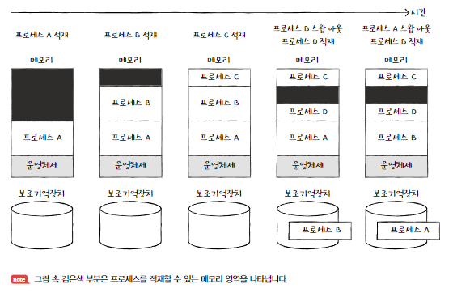
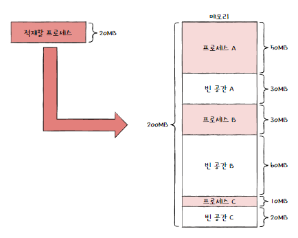

# 14-1. 연속 메모리 할당
- 연속적으로 메모리 공간을 할당하는 방식
## 스와핑
- 현재 실행되지 않는 프로세스를 임시로 보조기억장치 일부 영역으로 쫓아내고, 그렇게 생긴 메모리상의 빈 공간에 또 다른 프로세스를 적재하여 실행하는 방식
- 프로세스들이 요구하는 메모리 주소 공간의 크기가 실제 메모리 크기보다 큰 경우에도 프로세스들을 동시에 실행할 수 있음.

### 스왑 영역
- 프로세스들이 쫓겨나는 보조기억장치의 일부 영역
### 스왑 아웃
- 현재 실행되지 않는 프로세스가 메모리에서 스왑 영역으로 옮겨지는 것
### 스왑 인
- 스왑 영역에 있던 프로세스가 다시 메모리로 옮겨오는 것
- 스왑 아웃되었던 프로세스가 다시 스왑 인될 때는 스왑 아웃되기 전의 물리 주소와는 다른 주소에 적재될 수 있음

## 메모리 할당

### 최초 적합
- 운영체제가 메모리 내의 빈 공간을 순서대로 검색하다가 적재할 수 있는 공간을 발견하면 그 공간에 프로세스를 배치하는 방식
- A B C 순으로 빈 공간을 검색했다면, 프로세스는 빈 공간 A에 적재됨
- 프로세스가 적재될 수 있는 공간을 발견할 시 즉시 메모리를 할당하는 방식이므로, 검색을 최소화할 수 있고 결과적으로 빠른 할당이 가능함

### 최적 적합
- 

### 최악 적합
- 