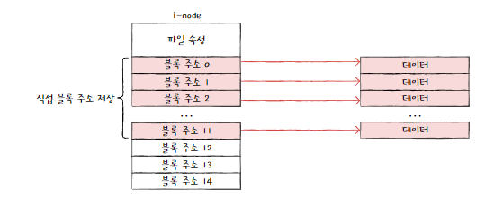
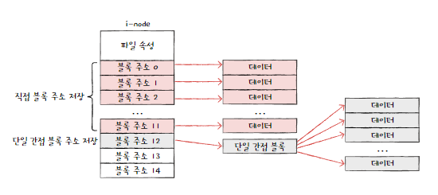
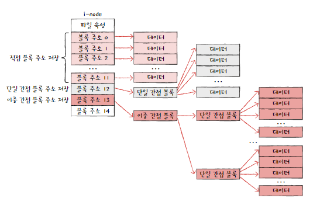
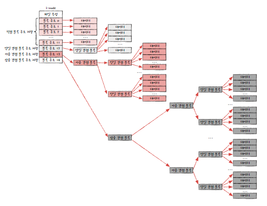
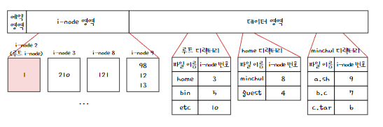

# 15-1. 파일과 디렉터리
## 파일
- 하드 디스크나 SSD와 같은 보조기억장치에 저장된 관련 정보의 집합 = 의미 있고 관련된 정보를 모은 논리적 단위
### 속성 = 메타데이터
- 부가정보
- 파일속성 : 파일의 속성은

### 파일 속성과 유형
- 파일유형 : 운영체제가 인식하는 파일 종류
    - 확장자 : 파일 종류가 무엇인지 운영체제에 알려주는 힌트
### 파일 연산을 위한 시스템 호출
- 생성, 삭제, 열기, 닫기, 읽기, 쓰기 등

## 디렉터리
- 폴더
- 파일을 관리하기 위한 도구
- 1단계 디렉터리 : 모든 파일이 하나의 디렉터리 안에 있음
- 트리 구조 디렉터리 : 여러 계층을 가진 디렉터리
    - 루트 디렉터리 : 최상위 디렉터리
- 경로 : 디렉터리를 이용해 파일 위치, 파일 이름을 특정 짓는 정보

### 절대 경로와 상대경로
- 절대 경로 : 루트 디렉터리에서 자기 자신까지 이르는 고유한 경로
- 상대 경로 : 현재 디렉토리로부터 시작하는 경로
### 디렉터리 연산을 위한 시스템 호출
- 생성, 삭제, 열기, 닫기, 읽기
### 디렉터리 엔트리
- 디렉터리 : 많은 운영체제에서 특별한 형태의 파일로 봄
- 디렉터리는 보조기억장치에 테이블 형태의 정보로 저장됨
- 디렉터 엔트리가 공통으로 포함하는 정보
    - 디렉터리에 포함된 대상의 이름
    - 그 대상이 보조기억장치 내에 저장된 위치를 유추할 수 있는 정보
> . : 부모 디렉터리
> .. : 루트 디렉터리

# 15-2. 파일 시스템
## 파티셔닝과 포매팅
### 파티셔닝 
- 저장 장치의 논리적인 영역을 구획하는 작업
### 파티션
- 파티셔닝 작업을 통해 나누어진 영역 하나하나
### 포매팅
- 파일 시스템을 설정하여 어떤 방식으로 파일을 저장하고 관리할 것인지를 결정하고, 새로운 데이터를 쓸 준비를 하는 작업
- 어떤 종류의 파일 시스템을 사용할지 결정남

## 파일 할당 방법
- 운영체제는 파일과 디렉터리를 블록 단위로 읽고 씀
- 하드디스크의 가장 작은 저장 단위는 섹터이지만, 운영체제는 하나 이상의 섹터를 블록이라는 단위로 묶고 관리함
    - 섹터로 관리하기엔 개수가 너무 많고, 크기도 작음
    - 크기가 작은 파일은 적은 수의 블록에 걸쳐 저장되고, 크기가 큰 파일은 여러 블록에 걸쳐 저장됨
- 파일을 보조기억장치에 할당하는 방법
    - 연속 할당
    - 불연속 할당
        - 연결 할당
        - 색인 할당
### 연속 할당
- 보조기억장치 내 연속적인 블록에 파일을 할당
- 파일에 접근하기 위해선 첫번째 블록 주소와 블록 단위의 길이만 알면 됨
- 장점 : 구현이 단순함
- 단점 : **외부 단편화**를 야기함
    - 중간에 위치한 파일이 삭제되면, 빈 공간에 크기 이상의 파일을 할당할 수 없음

### 연결 할당
- 연속 할당의 문제를 해결할 수 있음
- 각 블록 일부에 다음 블록의 주소를 저장하여 각 블록이 다음 블록을 가리키는 형태로 할당하는 방식
- 연결 리스트로 관리
- 불연속 할당의 일종
- 장점 : 외부 단편화 문제를 해결함
- 단점
    - 임의 접근 속도가 매우 느림 (성능면에서 비효율적임)
        - 반드시 첫번째 블록부터 하나씩 차례대로 읽어야 함 
    - 하드웨어 고장이나 오류 발생 시 해당 블록 이후 블록은 접근할 수 없음  
        - 하나의 블록 안에 파일 데이터와 다음 블록 주소가 모두 포함되어 있다보니, 하드웨어 고장이나 오류로 인해 파일을 이루는 블록에 하나라도 문제가 발생하면 그 블록 이후의 블록에 접근할 수 없음

### 색인 할당
- 파일의 모든 블록 주소를 색인 블록이라는 하나의 블록에 모아 관리하는 방식
- 장점 : 파일 내 임의의 위치에 접근하기 쉬움
- 색인 할당을 사용하는 파일 시스템에서는 디렉터리 엔트리에 파일 이름과 색인 블록 주소를 명시함

## 파일 시스템 살펴보기
### FAT 파일 시스템
- 연결할당 방식의 단점의 원인 : 블록 안에 다음 블록의 주소를 저장하였기 때문에
- 파일 할당 테이블(File Allocation Table) : 각 블록에 포함된 다음 블록의 주소들을 한데 모아 테이블 형태로 관리

예약 영역 | FAT 영역 | 루트 디렉터리 영역 | 데이터 영역

- 파티션 앞부분에 만들어짐
- FAT이 메모리에 적재된 채 실행되면 기존 연결 할당보다 다음 블록을 찾는 속도가 빨라지고, 임의 접근도 유리해짐
- FAT 파일 시스템의 디렉터리 엔트리
    - 파일 이름과 파일의 첫번째 블록 주소, 파일 속성

### 유닉스 파일 시스템
- 색인 할당 기반
- 색인 블록을 i-node라고 부름 : 파일 속성 정보가 표현됨
- 문제 : i-node의 크기는 유한함 -> 블록이 큰 파일의 경우 i-node 하나만으로 파일의 데이터 블록을 모두 가리킬 수 없음
- 해결
    1. 블록 주소 중 열두 개에는 직접 블록 주소를 저장함 (직접 블록)
    
    2. 열세 번째 주소에 단일 간접 블록 주소를 저장함
    > 단일 간접 블록 주소 : 파일 데이터가 저장된 블록이 아닌 파일 데이터를 저장한 블록 주소가 저장된 블록
    
    3. 열네 번째 주소에 이중 간접 블록 주소를 저장함
    
    > 이중 간접 블록 : 데이터 블록 주소를 저장하는 블록 주소가 저장된 블록
    4. 열다섯번 째 주소에 삼중 간접 블록 주소를 저장함
    

### 그 외 파일 시스템
- NT 파일 시스템(NTFS)
- ext 파일 시스템

### 저널링 파일 시스템
- 파일 시스템을 변경하는 도중에 전원이 나가거나 치명적인 오류로 컴퓨터가 강제로 종료되어 버린 상황(시스템 크래시)이 발생하면 파일 시스템이 훼손될 수 있음
- 이전에는 부팅 직후 파일 시스템을 검사하고 복구하는 프로그램을 실행시킴 -> 파일 시스템의 모든 블록에 대해 파일 시스템을 검사하기 때문에 시간이 오래걸림
- 저널링 파일 시스템 : 저널링 기법을 이용
- 저널링 기법 : 작업 로그를 통해 시스템 크래시가 발생했을 때 빠르게 복구하기 위한 방법
1. 작업 직전 파티션의 로그 영역에 수행하는 작업(변경 사항)에 대한 로그를 남김
2. 로그를 남긴 후 작업 수행
3. 작업이 끝나면 로그를 삭제
- 시스템 크래시가 발생하여 재부팅을 해야 한다면 로그 영역에 남긴 로그만 검사해도 됨

### 마운트
- 한 저장 장치의 파일 시스템에 접근할 수 있도록 파일 시스템을 편입시키는 작업
