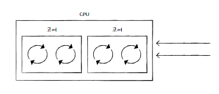
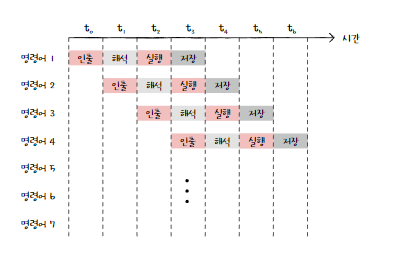

# 5-1. 빠른 CPU를 위한 설계 기법
## 클럭
- 컴퓨터 부품들은 '클럭 신호'에 맞춰서 일사불란하게 움직임
    - 클럭신호를 빠르게 하면?
    - 컴퓨터 부품들은 빠른 박자에 맞춰 움직임
    - CPU는 명령어 사이클을 더 빠르게 반복
    - 일반적으로 CPU 성능이 좋아짐
### 클럭 속도
- 헤르츠 단위로 측정
- 1초에 클럭이 몇 번 반복되는지 나타냄
- 클럭 속도는 일정하지 않음
    - 고성능을 요하는 순간에는 순간적으로 클럭 속도를 높임
    - 오버클럭킹 : 최대 클럭속도를 강제로 더 끌어올림
- 클럭속도를 높이면 발열 문제가 심각해짐

## 코어와 멀티코어
- CPU : 명령어를 실행하는 부품을 여러개 포함하는 부품으로 명칭의 범위 확장
- 코어 : 명령어를 실행하는 부품
### 멀티코어 | 멀티코어 프로세서 
- 코어를 여러 개 포함하는 CPU
- CPU 내에 명령어를 처리하는 일꾼이 여러명
- CPU의 연산 속도는 코어수에 비례하여 증가하진 않음
    - 코어마다 처리할 연산이 적절히 분배되지 않으면 코어 수에 비례하여 연산 속도가 증가하지 않음
    - 처리하고자 하는 작업량보다 코어 수가 지나치게 많아도 성능엔 영향이 크게 없음
## 스레드와 멀티스레드
- 스레드 : 실행 흐름의 단위
### 하드웨어적 스레드
- 하나의 코어가 동시에 처리하는 명령어 단위

- 멀티스레드 : 하나의 코어로 여려 명령어를 동시에 처리하는 CPU

### 소프트웨어적 스레드
- 하나의 프로그램에서 독립적으로 실행되는 단위

### 멀티스레드 프로세서
- 하드웨어 스레드 = 논리 프로세서
    - 2코어 4스레드
    - 프로그램 입장에선 하나의 명령어를 처리하는 CPU가 4개 있는 것처럼 보임
# 5-2. 명령어 병렬 처리 기법
- 명령어 병렬 처리 기법
    - 명령어 파이프라이닝
    - 비순차적 명령어 처리
## 명령어 파이프라인
1. 명령어 인출
2. 명령어 해석
3. 명령어 실행
4. 결과 저장
- CPU는 각 단계를 동시에 실행할 수 있음
### 명령어 파이프라이닝
- 동시에 여러 개의 명령어를 겹쳐 실행하는 기법
- 공장 생산 라인과 같이 명령어들을 명령어 파이프라인에 넣고 동시에 처리

### 파이프라인 위험
- 파이프라이닝이 특정 상황에서 성능 향상에 실패하는 경우
- 데이터 위험
- 제어 위험
- 구조적 위험
### 데이터 위험
- 명령어 간 데이터 의존성에 의해 발생
- 의존적인 두 명령어를 무작정 동시에 실행하려고 하면 발생
### 제어 위험
- 분기 등으로 인한 프로그램 카운터의 갑작스러운 변화에 의해 발생
- 프로그램 실행 흐름이 바뀌어 명령어가 실행되면서 프로그램 카운터 값에 갑작스러운 변화가 생기면 명령어 파이프라인에 미리 가지고 와서 처리중이었던 명령어의 쓸모가 없어짐
- 이를 위해 사용하는 기술
    - 분기 예측 : 프로그램이 어디로 분기할지 미리 예측한 후 그 주소로 인출하는 기술
### 구조적 위험
- 자원 위험
- 명령어들을 겹쳐 실행하는 과정에서 서로 다른 명령어가 동시에 ALU, 레지스터 등과 같은 CPU 부품을 사용하려고 할 때 발생

## 슈퍼스칼라
- CPU 내부에 여러 개의 명령어 파이프라인을 포함한 구조
- 슈퍼스칼라 프로세서 / 슈퍼스칼라 CPU : 슈퍼스칼라 구조로 명령어 처리가 가능한 CPU
- 파이프라인 위험 등의 예상치 못한 문제로 인해 반드시 파이프라인 개수에 비례하진 않음
## 비순차적 명령어 처리
- 명령어들을 순차적으로 실행하지 않는 기법
- 순서를 바꿔 실행해도 무방한 명령어를 먼저 실행하여 명령어 파이프라인이 멈추는 것을 방지하는 기법

# 5-3. CISC와 RISC
## 명령어 집합
