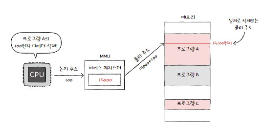
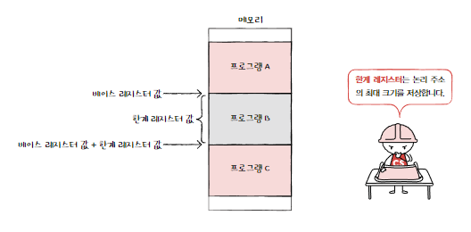
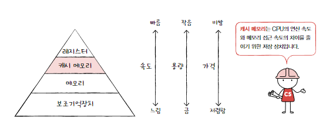
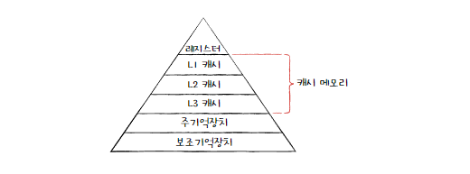

# 6-1. RAM의 특징과 종류

## RAM의 특징

- 실행할 프로그램의 명령어와 데이터 저장
- 휘발성 저장 장치 : 전원을 끄면 RAM에 저장된 명령어와 데이터가 모두 날아감
  > 보조기억 장치는 비휘발성 저장 장치로, 전원이 꺼져도 저장된 내용이 유지됨.
- CPU는 보조기억장치에 직접 접근하지 못해, 비휘발성 저장장치인 보조기억장치엔 '보관할 대상'을 저장하고, 휘발성 저장장치인 RAM에는 '실행할 대상' 저장
  > 실행하고 싶은 프로그램이 보조기억장치에 있을 경우, RAM으로 복사하여 저장한 뒤 실행함

## RAM의 용량과 성능

- RAM 용량이 적으면 보조기억장치에서 실행할 프로그램을 가져오는 일이 잦아, 실행시간이 길어짐
- RAM 용량이 충분히 크다면, 보조기억장치에서 많은 데이터를 가져와 미리 RAM에 저장할 수 있음 -> 많은 프로그램을 동시에 빠르게 실행 가능
  > 보조기억장치는 책이 꽂혀있는 책장, RAM은 책을 읽을 수 있는 책상. 책장을 오가는 시간에 영향. 그렇다고 책장이 아주 커져도 속도가 그에 비례해서 증가하진 않음.

## RAM의 종류

### DRAM

- Dynamic RAM : 데이터가 동적으로 변하는 RAM
- 단점 : 시간이 지나면 저장된 데이터가 점차 사라지는 RAM. 데이터의 소멸을 막기 위해 일정 주기로 데이터를 재활성화 해야 함.
- 장점 : 소비 전력이 비교적 낮고, 저렴하고, 집적도가 높기 때문에(더 작고 빽빽하게 만들 수 있음) 대용량으로 설계하기 용이함.

### SRAM

- Static RAM : 저장된 데이터가 변하지 않는 RAM
- 장점 : 시간이 지나도 저장된 데이터가 사라지지 않음. 주기적으로 데이터를 재활성화할 필요가 없음. DRAM보다 일반적으로 속도도 더 빠름
- 단점 : DRAM보다 집적도가 낮고, 소비 전력도 크고, 가격도 더 비쌈
  > 대용량으로 만들어질 필요는 없지만 속도가 빨라야 하는 저장 장치인 캐시 메모리에서 사용

### SDRAM

- Synchronous Dynamic RAM : 클럭 신호와 동기화된, 발전된 형태의 DRAM
- 클럭 타이밍에 맞춰 CPU와 정보를 주고받을 수 있는 DRAM
  > 장점 : 데이터 처리가 효율적이고 예측 가능, 동기화 덕분에 데이터를 더 빠르게 읽고 쓸 수 있음. 멀티태스킹 개선, 광범위한 호환성
  > 단점 : 시스템 클럭속도에 제한을 받음(속도 한계)
- DDR SDRAM에 밀려 잘 안씀

### DDR SDRAM

- 가장 흔히 사용되는 RAM
- Double Data Rate SDRAM : 대역폭(데이터를 주고받는 길의 너비)을 넓혀 속도를 빠르게 만든 SDRAM
  > 대역폭 : 자동차 도로
- 한 클럭에 하나씩 정보를 주고받을 수 있는 SDRAM과 비교했을 때 너비가 두 배인 도로!
  > DDR2 SDRAM은 DDR3 SDRAM보다 대역폭이 두 배 넓음. DDR4는 DDR3 보다 두배.최근에 가장 많이 쓰는 것은 DDR4 SDRAM

# 6-2 메모리의 주소 공간

- 메모리에 저장된 정보의 위치는 주소로 나타냄

## 물리 주소와 논리주소

### 물리 주소

- 메모리 하드웨어가 사용하는 주소

### 논리 주소

- CPU와 실행 중인 프로그램이 사용하는 주소
- 실행 중인 프로그램 각각에게 부여된 0번지부터 시작되는 주소

> CPU가 메모리와 상호작용하려면 논리 주소와 물리 주소간의 변환이 이뤄져야 함

### MMU (Memory Management Unit)

- CPU와 주소 버스 사이에 위치한 메모리 관리 장치
- CPU가 발생시킨 논리 주소에 베이스 레지스터 값을 더하여 논리주소와 물리 주소 간의 변환 수행

  > 베이스 레지스터는 프로그램의 가장 작은 물리주소 (프로그램의 첫 물리주소를 저장). 논리주소는 프로그램의 시작점으로부터 떨어진 거리

  

## 메모리 보호 기법

### 한계 레지스터

- 다른 프로그램의 영역을 침범할 수 있는 명령어는 위험하기 때문에, 논리 주소를 벗어나는 명령어 실행을 방지하고, 실행 중인 프로그램이 다른 프로그램에 영향을 받지 않도록 보호하는 역할을 담당
- 논리 주소의 최대 크기를 저장

  

  > CPU가 접근하려는 논리 주소는 한계 레지스터가 저장한 값보다 커선 안됨

- CPU는 메모리에 접근하기 전에 접근하고자 하는 논리 주소가 한계 레지스터보다 작은지 항상 검사함
- 만약 CPU가 한계 레지스터보다 높은 논리 주소에 접근하려고 하면 인터럽트(트랩)을 발생시켜서 실행을 중단함

# 6-3 캐시 메모리

- 캐시 메모리 : CPU의 연산 속도보다 느린 CPU의 메모리 접근 시간을 극복하기 위한 저장장치

## 저장장치 계층 구조(memory hierachy)

> CPU와 가까운 저장 장치는 빠르고, 멀리 있는 저장 장치는 느림.
> 속도가 빠른 저장 장치는 저장 용량이 작고, 가격이 비쌈

- CPU에 얼마나 가까운가를 기준으로 계층적으로 나타낼 수 있음

  

## 캐시 메모리

- CPU와 메모리 사이에 위치하고, 레지스터보다 용량이 크고 메모리보다 빠른 SRAM기반의 저장 장치
- CPU의 연산 속도와 메모리 접근 속도의 차이를 줄이기 위해 탄생함
- CPU가 매번 메모리에 왔다갔다하는 건 오래 걸림 -> 메모리에서 CPU가 사용할 일부 데이터를 미리 캐시 데이터로 가지고 와서 활용
  > CPU : 집, 캐시 메모리 : 편의점, 메모리(RAM) : 마트

---

- 캐시 메모리도 CPU와 가까운 순서대로 계층을 구성
- L1 캐시는 코어와 가장 가까운 캐시 메모리, L2 캐시는 그 다음 가까운 캐시, L3 캐시는 그 다음.
- 캐시 메모리 용량 : L1 < L2 < L3
- 속도 : L1 > L2 > L3
- 가격 : L1 > L2 > L3
- CPU가 메모리 내에 데이터가 필요하다고 판단하면 L1 -> L2 -> L3순으로 데이터를 검색
- 멀티코어 프로세서에서는 L1캐시와 L2캐시는 코어마다 고유한 캐시 메모리로 할당되고, L3캐시는 여러 코어가 공유하는 형태로 사용됨

  > 분리형 캐시 : 코어와 가까운 L1 캐시를 조금이라도 접근 속도를 빠르게 만들기 위해 명령어만을 저장하는 L1캐시인 L1I캐시와 데이터만을 저장하는 L1D캐시로 분리하는 경우.

  

## 참조 지역성 원리

- 캐시 메모리는 메모리보다 용량이 작으므로, 메모리의 모든 내용을 저장할 순 없음.
- 메모리가 보조기억장치 일부를 복사 저장하는 것처럼, 캐시 메모리도 메모리의 일부를 복사 저장함
- 그렇다면 캐시 메모리가 무엇을 저장해야 하는가?

  > 보조기억장치 : 전원이 꺼져도 기억할 대상 저장

  > 메모리 : 실행 중인 대상 저장

- 캐시 메모리는 CPU가 사용할 법한 대상을 예측 저장
  - 캐시 히트 : 예측 데이터가 실제로 들어맞아 캐시 메모리 내 데이터가 CPU에서 활용될 경우
  - 캐시 미스 : 예측이 틀려 메모리에서 필요한 데이터를 직접 가져와야 하는 경우
    > 캐시 미스가 자주 발생하면 성능이 떨어짐

### 캐시 적중률

- 캐시가 히트되는 비율
  > 캐시 히트 횟수 / (캐시 히트 횟수 + 캐시 미스 횟수)
- 캐시 메모리의 이점을 활용하려면 CPU가 사용할 법한 데이터를 제대로 예측해서 캐시 적중률을 높여야 함

### 참조 지역성의 원리

- CPU가 사용할 법한 데이터를 아는 방법 -> 한가지 원칙에 따라 메모리로 가져올 데이터 결정
- CPU가 메모리에 접근할 때의 주된 경향을 바탕으로 만들어진 원리

### 시간 지역성

1. CPU는 최근에 접근했던 메모리 공간에 다시 접근하려는 경향이 있다.

- EX: 프로그래밍시, 저장된 변수에 여러번 다시 접근

### 공간 지역성

2. CPU는 접근한 메모리 공간 근처를 접근하려는 경향이 있다.

- CPU가 실행하려는 프로그램은 보통 관련 데이터들끼리 한데 모여 있음(EX: 워드프로세서 프로그램의 기능에 관한 데이터는 모여 저장)
- CPU가 프로그램을 실행할 때는, 프로그램이 모여있는 공간 근처를 집중적으로 접근할 것

# CS 질문

## Q. RAM을 주기억장치라고 표현하는 이유는 무엇인가요?

컴퓨터가 어떠한 프로그램을 실행하는 동작에 대해 설명해보겠다.
먼저 보조기억장치에서 주기억장치로 프로그램을 불러온다.(부팅, 로딩)
주기억장치에서 프로그램을 기억하고 CPU와 통신할 준비가 끝나면 CPU에서 데이터를 주고받으며 프로그램을 구동한다. (동작, 구동)
따라서 컴퓨터 입장에서는 RAM은 작업실, CPU는 작업자와 같은 역할을 하게 된다. 이런 역할 때문에 주기억장치라고 표한한다.

## Q. 왜 불편하게 전원이 차단되면 모든 기억된 내용이 지워지는 휘발성 장치를 사용할까요?

아직 휘발성 특성, 단점을 가진 기계적 부품 이외에는 주기억장치의 역할을 할 부품이 상용, 양산화가 힘들기 때문이다.

빠른 속도와 효율을 제공해주기 때문에 휘발성임에도 불구하고 사용된다. 만일 기술의 발전으로 다른 방법이 생기면 이러한 단점이 사라질 수도 있다.

## Q. 캐시 Hit Rate를 높이기 위해 사용하는 지역성(Locality) 원리 2가지는?

캐시가 효율적으로 작동하려면 캐시에 저장되는 데이터들이 지역성을 가져야 하는데, 공간적 지역성과 시간적 지역성으로 나눌 수 있습니다.

공간적 지역성은, 대부분 프로그램은 참조한 주소와 인접한 주소의 내용을 다시 한 번 참조하는 특성이 있다는 것입니다.

시간적 지역성은, 한 번 참조한 주소를 다시 한 번 재참조하는 특성이 있다는 것입니다.

## Q. 메모리의 종류에 대해 설명하고, 종류가 여러가지인 이유에 대해 설명해주세요.

닫기
CPU에 가까운 순서대로 레지스터, 캐시, 주기억장치, 보조기억장치가 있습니다.

물리적 메모리의 종류가 많은 이유는, 접근 속도에 따른 차이를 두기 위해서입니다. (레지스터 > 캐시 > 주기억장치 > 보조기억장치)

# 참고 자료

https://bamtori.tistory.com/89
