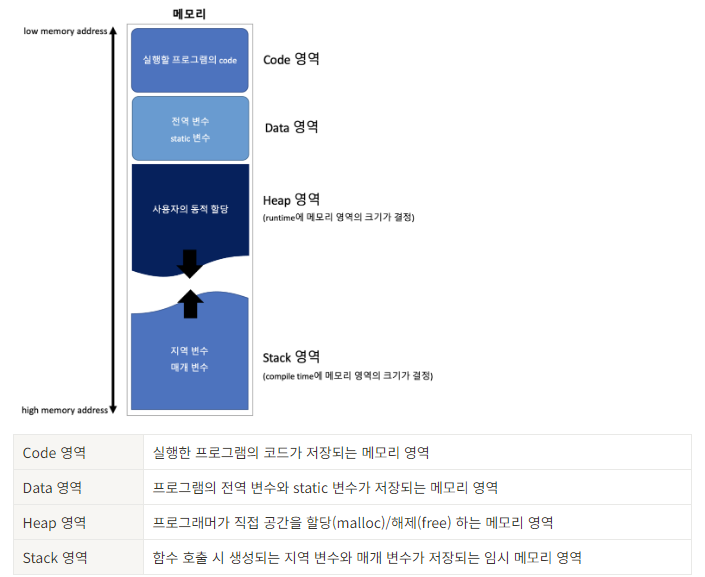

# 9. 운영체제 시작하기

# 운영체제 (Operating System)

: 실행할 프로그램에 필요한 자원을 할당하고, 프로그램이 올바르게 실행되도록 돕는 프로그램
(메모리의 사용자 영역에 적재된 프로그램들에 자원을 할당, 올바르게 실행되도록 함)

⇒ 사용자가 실행하는 프로그램을 위한 프로그램

- 자원 (시스템 자원) : 프로그램 실행에 마땅히 필요한 요소
    
    모든 프로그램은 실행되기 위해 반드시 자원이 필요함
    

<aside>
💡 메모리 영역

> 모든 프로그램은 실행 시 메모리에 적재되어야 한다.
> 
- 커널 영역 (Kernel space) : 컴퓨터 부팅 시 운영체제가 적재되는 메모리 영역
- 사용자 영역 (User space) : 사용자가 이용하는 응용 프로그램이 적재되는 메모리 영역
    - 응용 프로그램 (application software)
    : 사용자가 특정 목적을 위해 사용하는 일반적인 프로그램
</aside>

## 운영체제의 역할

- 응용 프로그램을 사용자 영역에 적재 (메모리 주소가 겹치지 않도록 적당한 공간에 적재)
    
    더이상 실행되지 않는 프로그램을 메모리에서 삭제 ⇒ 메모리 자원 관리
    
- 프로그램들의 CPU 사용 순서 & CPU 사용 시간 배정
    
    (최대한 공정하게 응용 프로그램이 CPU 자원을 사용할 수 있도록 할당)
    
- 응용 프로그램과 하드웨어 사이에서 필요한 자원을 할당하고, 응용 프로그램이 올바르게 실행되도록 관리
    
    (응용 프로그램이 하드웨어 자원에 직접 접근하는 것을 방지해 자원을 보호)
    

## 운영체제를 알아야 하는 이유

- 운영체제 역시 프로그램이기 때문에 개발자와 대화 가능 (오류 메시지)
    
    ⇒ 프로그램을 더 깊이 이해할 수 있음
    
    ⇒ 문제 발생 시 하드웨어 상태 등의 정보를 확인하며 문제 해결 실마리 찾을 수 있음
    

# 운영체제 개괄

## 운영체제 커널 (Kernel)

: 운영체제의 핵심 서비스(자원 접근 & 조작, 프로그램 안전 실행)를 담당하는 부분

- 운영체제가 설치된 모든 기기에는 커널이 있다.
    
    어떤 커널을 사용하는지에 따라 프로그램의 하드웨어 이용 양상, 컴퓨터 성능이 달라짐
    
- 사용자 인터페이스 (UI, User Interface)
    
    : 사용자가 컴퓨터와 상호작용할 수 있는 통로
    
    - 그래픽 유저 인터페이스 (GUI) : 그래픽 기반 컴퓨터 상호작용
    - 커맨드 라인 인터페이스 (CLI) : 명령어 기반 컴퓨터 상호작용
    
    ⇒ 운영체제가 제공하는 서비스지만, 컴퓨터와의 상호작용을 위한 통로일 뿐 커널에 속한 기능은 아님
    
    ⇒ 같은 커널을 사용하더라도 사용자 인터페이스는 다를 수 있음
    

## 운영체제 이중 모드 (Dual Mode)

: CPU가 명령어를 실행하는 모드를 사용자 모드와 커널 모드로 구분하는 방식

⇒ CPU는 명령어를 사용자 모드로써 실행할 수 있고, 커널 모드로써 실행할 수 있음

- 사용자 모드 (user mode)
: 운영체제 서비스를 제공받을 수 없는 실행 모드
    
    (커널 영역의 코드를 실행할 수 없는 모드)
    
    - CPU는 입출력 명령어와 같이 하드웨어 자원 접근 명령어 실행 불가 → 사용자 모드로 실행되는 응용 프로그램 자원 접근 불가
    - 사용자 모드로 실행되는 프로그램은 시스템 호출을 통해 커널 모드로 전환해 운영체제 서비스 제공 받을 수 있음
        
        > 시스템 호출
        > 
        > 
        > : 운영체제 서비스를 제공받기 위한 요청, 소프트웨어 인터럽트의 일종
        > 
- 커널 모드 (kernel mode)
    
    : 운영체제 서비스를 제공받을 수 있는 실행 모드
    
    (커널 영역의 코드를 실행할 수 있는 모드)
    
    - CPU가 자원에 접근하는 명령어를 비롯한 모든 명령어 실행 가능 → 자원 접근 가능
- CPU의 사용 모드 확인 방법
    
    : 플래그 레지스터 속 슈퍼바이저 플래그를 통해 알 수 있음
    

<aside>
💡 가상화를 지원하는 현대의 CPU는 2가지 모드 이상을 지원한다

- 가상 머신 : 소프트웨어적으로 만들어낸 가상 컴퓨터
    
    ⇒ 가상 머신을 설치하면 새로운 운영체제와 응용 프로그램을 설치, 실행 가능
    
</aside>

## 운영체제 시스템 호출

> 일반적으로 응용 프로그램은 실행 과정에서 운영체제 서비스들을 매우 빈번하게 이용한다
> 
> 
> ⇒ 빈번하게 시스템 호출을 발생시키고 사용자 모드와 커널 모드 오가며 실행
> 

: 운영체제 서비스를 

### 시스템 호출 진행 과정

1. 운영체제 서비스 이용이 필요한 응용 프로그램이 시스템 호출 발생
2. 응용 프로그램이 커널 모드로 전환 → 운영체제 서비스 이용
3. 서비스 이용 종료 시 사용자 모드로 복귀 → 남은 실행 제공

## 운영체제의 핵심 서비스

### 프로세스 관리

> 프로세스 (process) : 실행 중인 프로그램
> 

: 일반적으로 하나의 CPU는 한번에 하나의 프로세스만 실행할 수 있기에 프로세스들을 조금씩 번갈아가며 실행함

(한 프로세스를 실행하다가 다른 프로세스로 실행을 전환하는 것을 반복)

- 운영체제는 다양한 프로세스를 일목요연하게 관리하고 실행할 수 있어야 함

### 자원 접근 및 할당

> 운영체제는 컴퓨터의 4가지 핵심 부품, CPU, 메모리, 입출력장치 (보조기억장치 포함)를 관리하고 그에 대한 기능을 제공한다.
> 
- CPU
    
    : 운영체제는 프로세스들에 공정하게 CPU를 할당하기 위해 어떤 프로세스부터 CPU를 이용하게 할 것인지, 얼마나 오래 CPU를 이용하게 할 것인지 결정할 수 있어야 한다
    
    ⇒ CPU 스케줄링
    
- 메모리
    
    : 운영체제는 프로세스에게 어떻게 메모리를 할당하는지, 메모리가 부족할 경우 어떻게 극복하는지를 다룸
    
- 입출력 장치
    
    : 인터럽트의 서비스 루틴은 운영체제가 제공하는 기능 → 커널 영역에 존재
    
    ⇒ 운영체제는 인터럽트를 처리하는 프로그램, 인터럽트 서비스 루틴을 제공하면서 입출력 작업을 수행함
    

### 파일 시스템 관리

- 운영체제는 보조기억장치 속 데이터를 파일과 디렉터리로 관리함

## 프로세스

- 실행 중인 프로그램 (program in execution)
    
    실행 파일 형태로 존재하던 프로그램이 메모리에 적재되어 CPU에 의해 실행 (연산)되는 것
    
    - 프로그램 : 명령어 리스트를 포함하는 파일
- 프로세스에 할당되는 메모리 공간
    
    : 4개의 영역 (Code, Data, Stack, Heap)으로 이뤄지며, 각 프로세스마다 독립적으로 할당 받음
    
    
    
- 프로세스의 실행
    1. 프로그램이 메모리 내에 4개의 영역으로 구분되어 적재되며 프로세스로 이해된다.
    2. 프로세스의 Code 영역에 적재되어 있는 명령어 주소값이 CPU의 PC 레지스터(Program Counter Register)에 저장된다.
    3. CPU는 PC 레지스터를 기반으로 메모리에 적재된 정보를 이용해 연산을 수행한다.

## 문제

### 1. 운영체제의 이중 모드에 대해서 설명하고, 사용자 모드 상태인 응용 프로그램이 커널 모드로 어떻게 전환되는지 설명하세요.

- chatGPT
    
    운영체제의 이중 모드란 **사용자 모드(User Mode)**와 **커널 모드(Kernel Mode)** 두 가지 모드를 의미합니다.
    
    사용자 모드는 일반 응용 프로그램이 실행되는 모드로, 제한된 자원만 접근할 수 있어 시스템의 안정성과 보안을 유지할 수 있습니다. 반면에 커널 모드는 운영체제의 핵심 기능이 동작하는 모드로, 모든 자원에 접근할 수 있는 권한을 가지고 있습니다.
    
    사용자 모드에서 실행 중인 응용 프로그램이 커널 모드로 전환되는 방법은 **시스템 콜(System Call)**입니다. 응용 프로그램이 입출력 작업, 파일 관리, 프로세스 제어 등의 작업을 필요로 할 때, 직접 하드웨어에 접근할 수 없기 때문에 운영체제의 커널에게 요청하게 됩니다. 이때 시스템 콜을 통해 CPU는 사용자 모드에서 커널 모드로 전환되며, 커널 모드에서 필요한 작업을 수행한 후 다시 사용자 모드로 돌아갑니다. 이 과정에서 트랩(Trap)이나 인터럽트(Interrupt) 등의 메커니즘이 사용됩니다.
    
- 나의 답변
    
    운영체제의 이중 모드는 응용 프로그램이 가질 수 있는 2가지 모드를 의미하며 사용자 모드와 커널 모드가 있다.
    
    사용자 모드는 일반적인 응용 프로그램이 실행되는 모드로, 하드웨어 접근과 같은 운영체제 서비스를 이용할 수 없는 상태를 의미한다.
    
    커널 모드는 운영체제 서비를 받을 수 있는 실행 모드를 의미한다.
    
    운영체제가 이중 모드로 구분지어 프로그램의 상태를 구분하는 이유는 시스템의 안정성과 보안을 위해 하드웨어 자원에 아무 프로그램이나 접근하지 못하도록 하기 위함이다.
    
    사용자 모드에서 실행 중인 응용 프로그램은 시스템 콜을 이용해서 커널 모드로 전환될 수 있다. 시스템 콜을 통해 응용 프로그램은 커널 모드로 전환되어 운영체제 서비스를 이용할 수 있으며, 커널 모드에서 필요한 작업을 모두 수행한 이후에는 다시 사용자 모드로 복귀한 뒤 이후의 작업을 수행한다.
    

### 2. 프로세스가 무엇인지, 프로그램이 어떻게 프로세스가 되어 CPU에서 실행되는지 설명하세요.

- chatGPT
    
    **프로세스**란 실행 중인 프로그램을 의미합니다. 프로그램이 단순히 디스크에 저장된 정적인 코드라면, 프로세스는 메모리에서 실행 중인 동적인 개체라고 할 수 있습니다.
    
    프로그램이 프로세스로 변환되는 과정은 다음과 같습니다.
    
    먼저, 프로그램이 실행되면 운영체제는 해당 프로그램을 메모리에 로드하고, 프로그램에 필요한 프로세스 제어 블록(PCB, Process Control Block)을 생성합니다. PCB에는 프로세스의 상태, 프로그램 카운터, 레지스터 정보, 메모리 관리 정보 등이 포함됩니다.
    
    그 후, 스케줄러에 의해 프로세스가 CPU에 할당되면, 프로그램의 명령어가 하나씩 CPU에서 실행되기 시작합니다. 이 과정에서 프로그램은 프로세스로서 CPU와 메모리, 입출력 장치 등 시스템 자원을 할당받아 동작하게 됩니다.
    
- 나의 답변
    
    프로세스는 프로그램이 메모리에 적재되어 CPU에서 실행되는 상태를 의미한다. 보조기억장치에 저장되어 있던 프로그램은 메모리에서 일정 부분을 할당받아 적재되고, 이 때 코드 영역, 데이터 영역, 스택 영역, 힙 영역의 4가지 영역에 맞춰 구분된다.
    
    CPU에서 프로세스를 실행할 때는 CPU내의 PC 레지스터 (프로그램 카운터 레지스터)에 명령어의 주소값이 저장되며, 한개의 명령어를 수행한 이후에는 프로그램 카운터의 값이 증가하며 다음 명령어를 수행할 수 있도록 된다.
    

### 3. 프로세스의 메모리 영역 4가지에 대해서 설명하세요.

- chatGPT
    
    프로세스는 메모리에서 4가지 주요 영역으로 구분됩니다.
    
    1. **코드 영역 (Text Segment)**:
        
        프로그램의 실행 코드가 저장되는 영역입니다. 컴파일된 기계어 코드가 위치하며, 보통 읽기 전용으로 설정됩니다.
        
    2. **데이터 영역 (Data Segment)**:
        
        전역 변수 및 정적 변수가 저장되는 영역입니다. 프로그램이 실행되는 동안 데이터의 값이 변경될 수 있습니다. 초기화된 변수와 초기화되지 않은 변수로 나뉘어 관리되기도 합니다.
        
    3. **힙 영역 (Heap Segment)**:
        
        동적 메모리 할당이 이루어지는 영역입니다. 런타임 중에 `malloc`, `free` 등의 함수로 메모리를 동적으로 할당하고 해제할 수 있으며, 힙 영역은 주로 프로그램 실행 중에 크기가 동적으로 변합니다.
        
    4. **스택 영역 (Stack Segment)**:
        
        함수 호출 시의 지역 변수, 매개 변수, 리턴 주소 등이 저장되는 영역입니다. 함수가 호출될 때마다 새로운 스택 프레임이 생성되고, 함수가 종료되면 해당 스택 프레임이 해제됩니다. 스택은 일반적으로 힙과 반대 방향으로 성장하며, 한정된 크기를 가지고 있습니다.
        
    
    이 네 가지 영역은 프로세스가 메모리에서 효율적으로 동작하도록 관리되며, 각각의 역할이 명확히 구분됩니다.
    
- 나의 답변
    
    프로세스의 메모리 영역에는 코드 영역, 데이터 영역, 스택 영역, 힙 영역이 존재한다.
    
    코드 영역은 프로세스의 명령어가 저장되는 위치이며, 데이터 영역은 프로그램의 전역 변수와 정적 변수가 저장된다. 스택 영역은 프로그램 내의 함수 호출 시 생성되는 지역 변수, 매개변수가 저장된다. 힙 영역은 사용자가 직접 메모리를 할당 (malloc)하고 해제(free)하는 메모리 영역을 의미한다.