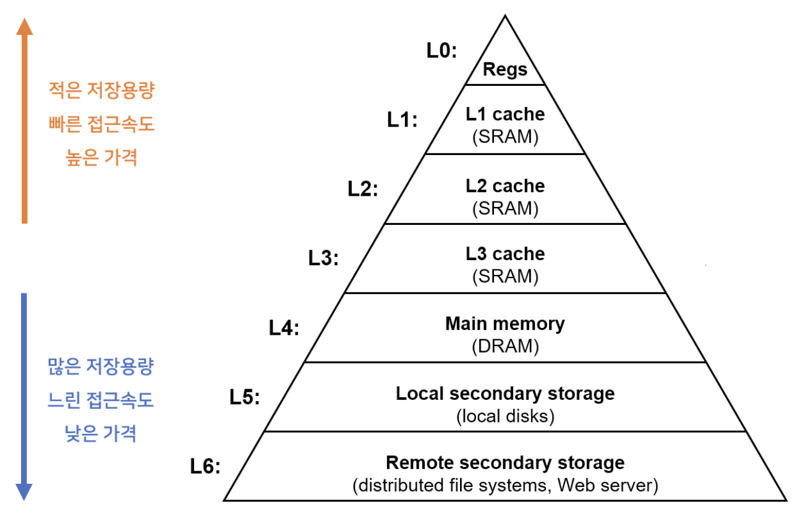

# 메모리
## RAM의 특징과 종류
### RAM의 특징
- 실행할 프로그램의 명령어와 데이터가 저장
- RAM의 용량이 충분히 크다면 보조기억장치에서 많은 데이터를 가져와 미리 RAM에 저장할 수 있음

### RAM의 종류

**DRAM**
- Dynamic RAM
- 시간이 지나면 저장된 데이터가 점차 사라지는 RAM
- 데이터 소멸 막기 위해 일정 주기로 데이터 재활성화
- 소비 전력이 낮고, 저렴하고, 집적도가 높음 - 대용량 설계 용이

**SRAM**
- Static RAM
- Dynamic RAM과 반대 특성

**SDRAM**
- Synchronous Dynamic RAM
- 클럭 타이밍에 맞춰 CPU와 정보를 주고받을 수 있음

**DDR SDRAM**
- Double Data Rate SDRAM
- 대역폭(Data Rate, 데이터를 주고 받는 길의 너비)을 넓혀 속도를 빠르게 만든 SDRAM

## 메모리의 주소 공간

### 물리 주소와 논리 주소
- 물리 주소(physical address) : 정보가 실제로 저장된 하드웨어상의 주소
- 논리 주소(logical address) : 실행중인 프로그램 각각에게 부여된 0번지부터 시작되는 주소

**메모리 관리 장치(Memory Management Unit, MMU)**
- 논리 주소를 물리 주소로 변환
- CPU가 메모리에 접근하는 것을 총 관리
- 메인 메모리의 직접 접근은 비효율적
    - CPU와 메인 메모리 속도를 맞추기 위해 캐시가 존재
- 베이스 레지스터: 15000, CPU 논리주소: 100
    - 물리주소: CPU 논리주소 + 베이스 레지스터 = 15100
> - 베이스 레지스터 : 프로그램의 가장 작은(첫) 물리 주소
> - 논리 주소 : 프로그램의 시작점으로부터 떨어진 거리

### 메모리 보호 기법
- 프로세스는 독립적인 메모리 공간을 가져야 하고, 자신만의 공간만 접근 가능

**한계 레지스터(limit register)**
> - base 레지스터 : 프로그램의 가장 작은(첫) 물리 주소
> - limit 레지스터 : 프로세스 사이즈 저장

- 합법적인 메모리 영역(x) : `base <= x < base + limit`
- 커널 모드에서만 수정 가능(사용자 모드는 X)
- 논리 주소가 limit 레지스터보다 작지 않으면 trap 발생

### 메모리 과할당(over allocating)
- 실제 메모리 사이즈보다 더 큰 사이즈의 메모리를 프로세스에 할당한 상황
- 가상 메모리 사용시 실제 메모리사이즈 보다 더 큰 사이즈 메모리 사용하는 것처럼 보일 수 있음
- 프로세스 실행 도중 페이지 폴트 발생
    - 페이지 폴트를 발생시킨 페이지 위치를 디스크에서 찾기
    - 빈 프레임이 그런데 없다면? - 빈 프레임 확보 필요
- 빈 프레임 확보 방법 - **swapping 기법**
    - 메모리에 올라와 있는 한 프로세스 종료
    - 프로세스 하나는 swap out

## 캐시 메모리

### 계층구조


- 대부분의 컴퓨터 프로그램들은 프로그램의 작은 부분에 자주 접근하기 때문에, 그 작은 부분만을 비싼 메모리에 저장하고 사용하면 프로그램의 전체적인 성능이 향상
- 컴퓨터 메모리는 용량이 많고 느린 아래쪽에서 시작해서 용량이 작고 빠른 위쪽으로 올라가는 계층구조 - **메모리 계층 구조**
- CPU와 가까울수록 빠르고 멀수록 느림
- 속도가 빠른 저장 장치는 저장 용량이 작고 가격이 비쌈
- **Memory vs Disk**
    - 메모리는 빠르지만 용량이 작고 비쌈 ↔ disk는 느리지만 용량이 크고 저렴
    - 메모리는 휘발성 ↔ 디스크는 비휘발성

### 캐시 메모리(cache memory)
- 데이터나 값을 저장하는 **임시 저장소**로, 데이터를 더 빠르고 효율적으로 액세스
    - CPU와 메모리 사이 위치
    - 레지스터보다 용량이 크고 메모리보다 빠른 SRAM 기반 저장 장치
    - 동일한 데이터에 **반복해서 접근**해야 하거나 많은 연산이 필요할 때 적합
    - 캐시는 컴퓨터의 **성능을 향상** 시키기 위해 사용되는 메모리
- **동작 방식**
    - 시스템은 데이터 요청 시 먼저 캐시를 확인하여 필요한 데이터가 있는지 검사
    - 캐시에 원하는 데이터가 없거나, 너무 오래되어 최신성을 잃으면 원본 데이터 소스에 접근
    - 캐시에 데이터가 있으면 캐시에서 바로 제공
    - 캐시 공간은 작으므로, 공간이 모자라게 되면 안 쓰는 데이터부터 삭제하여 공간을 확보
- L1, L2, L3 캐시
    - L1 캐시와 L2 캐시는 코어마다, L3는 여러 코어가 공유
    - L1 캐시는 명령어 저장(L1I)과 데이터 저장(L1D)로 나뉘기도 함 - 분리형 캐시(split cache)

### 참조 지역성 원리(locality of reference, principle of locality)
> - 최근 접근한 데이터에 다시 접근하는 경향
> - 최근 접근한 데이터의 주변 공간에 다시 접근하는 경향

```java
for (int i = 0; i < 10; i++) {
  arr[i] = i;
}
```

- **시간 지역성**
    - 최근 접근한 데이터에 다시 접근하는 경향
    - CPU는 변수가 저장된 메모리 공간을 언제든 다시 참조
    - 변수 i에 짧은 시간에 여러번 접근하는 것
- **공간 지역성**
    - 최근 접근한 데이터의 주변 공간에 다시 접근하는 경향
    - 배열 arr의 각 요소를 참조하며 가까운 메모리 공간에 연속적으로 접근 (배열 요소들이 연속적으로 메모리에 할당되기 때문)

### 캐싱의 필요성
- **병목 현상을 완화하기 위해** CPU와 메인 메모리(RAM) 사이에 크기는 작지만 속도가 빠른 캐시 메모리를 두고, 향후 재사용할 가능성이 클 것으로 예상되는 데이터의 복사본을 저장해 둔 CPU가 요청하는 데이터를 바로바로 전달
    > 병목현상
    > - 시스템의 성능, 처리 능력이 특정 구성 요소의 제한된 용량으로 인해 저하되는 현상
    > - 시스템 내에서 데이터가 처리되거나 전송될 때, 가장 느린 부분이 전체 시스템의 성능을 결정하는 상황
    > - 시스템의 어느 한 부분에 과도한 부하가 집중될 때 발생

- **데이터 접근 시간 감소**
    - 캐싱은 자주 사용되는 데이터를 빠르게 접근할 수 있는 메모리에 저장함으로써, 데이터베이스나 디스크와 같은 느린 저장 매체로의 접근을 줄임
    - 데이터 접근에 소요되는 시간을 크게 단축
    - 데이터베이스 병목 현상을 완화

- **부하 분산**
    - 캐싱은 데이터베이스 서버나 파일 시스템에 가해지는 부하를 줄임
    - 캐시에 데이터가 있을 경우, 시스템은 데이터베이스에 접근하지 않고 캐시에서 데이터를 가져옴
    - 서버의 부하를 분산시켜 전체 시스템의 성능을 향상시킨다.

### 용어

- **캐시 히트(cache hit)**
    - CPU에서 요청한 데이터가 캐시에 존재하는 경우
- **캐시 미스(cache miss)**
    - CPU에서 요청한 데이터가 캐시에 존재하지 않는 경우
- **캐시 적중률(cache hit ratio)**
    - `cache hit / (cache hit + cache miss)`

- cpu 프로세서가 캐시 메모리에 데이터를 write 하게 되면, **캐시 일관성(Cache Coherence)**을 위해 데이터를 메모리나 보조 기억장치 등의 메모리 저장소에도 데이터를 write 

    - 캐시 일관성?
        - 멀티 코어 시스템에서는 다른 코어에 의해 메모리 데이터가 변경될 수 있으므로, 현재 캐시에 저장되어 있는 데이터가 메모리의 최신 상태와 같다고 보장할 수 없다.
        - 각 코어에 있는 캐시 메모리의 데이터를 동일하게 유지해야만 하며 이는 데이터 일관성 (Data Coherence)을 유지하는 것
        - 메모리 내용을 갱신하게 되는 경우 이 사실을 다른 코어들에게 전달하고 각 코어의 기존 데이터를 무효화 해야 하며 이 과정을 구현한 것이 캐시 일관성 (Cache Coherence)
    - **Write-through**
        - 캐시 메모리에 데이터가 write 되는 그 시점에 데이터를 메모리에 저장하는 정책
        - 캐시 메모리와 실제 메모리 저장소 모두에 데이터를 업데이트하는 정책
            - 장점: 캐시 일관성을 유지할 수 있어 안정적
            - 단점: 처리 속도가 느려짐 ⇒ 메모리나 디스크는 캐시 메모리보다 처리속도가 느리기 때문
    - **Write-back(Lazy Write)**
        - 우선 캐시 메모리에만 데이터를 write 하여 사용하다가, 캐시 메모리가 새로운 데이터 블록으로 교체 될 때에 데이터를 메모리에 저장하는 정책
        - 캐시 메모리에 있는 데이터를 여러 번 overwrite 하여 사용하다가, 캐시 메모리가 해제되는 때에 메인 메모리에 데이터를 업데이트
            - 장점: Write-through보다 빠름
            - 단점: 구현이 어렵고, 캐시 일관성 유지가 어렵다 ⇒ 변경된 데이터를 기억하여 실제 메모리 저장소에 데이터를 write 해주어야 하기 때문
    - **Dirty bit(Modified bit)**
        - 이렇게 write를 통해 값이 변경된 데이터를 표시하기 위한 bit
        - dirty bit를 통해 해당 page가 변경됐는지를 확인할 수 있고 이를 바탕으로 disk에 저장해줌으로 데이터의 손실을 막을 수 있음
    - **Invalidation(캐시 무효화)**
        - 데이터가 더 이상 유효하지 않거나 유용하지 않을 때 시스템 캐시에서 데이터를 제거하여 캐시를 무효화하는 프로세스
        - 캐시에서 무효하거나 오래된 데이터를 제거하여 최신의 데이터를 사용하여 캐시 일관성을 향상
        - 캐시된 데이터가 원본 데이터 소스에서 변경되었을 때, 해당 캐시를 무효화함으로써 데이터의 일관성을 보장