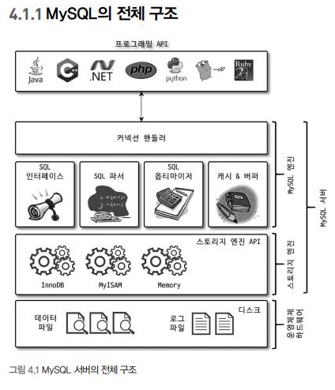

# Real My SQL 4장

Favorite: No
Reviewed: No
Status: Study Review
날짜: 2024년 12월 10일
생성 일시: 2024년 12월 10일 오후 3:35

# 04 아키텍처

## 4.1 MySQL 엔진 아키텍처



### My SQL 엔진

- 커넥션 핸들러 (클라이언트로부터의 접속 및 쿼리 요청을 처리), SQL 파서 및 전 처리기, 옵티마이저 (쿼리의 최적화된 실행)로 구성
- 표준 SQL 문법을 지원하기 때문에 타 DBMs와 호환되어 실행될 수 있음
- 요청된 SQL 문장을 분석하거나 최적화하는 역할 (DBMS의 두뇌에 해당)

<aside>
📌

오라클에서는 다른 엔진 사용하나?

</aside>

### 스토리지 엔진

- 실제 데이터를 디스크 스토리지에 저장하거나, 디스크 스토리지로부터 데이터를 읽어오는 부분
- MySQL 서버에서 MySQL엔진은 하나지만 스토리지 엔진은 여러 개를 동시에 사용 가능

```sql
CREATE TABLe test_table (fd1 INT, fd2 INT) ENGINE=INNODB;
-- InnoDB 스토리지 엔진을 사용하도록 정의
```

<aside>
📌

스토리지 엔진을 여러개 동시에 사용한다는 것은 무슨 의미?

</aside>

### 핸들러 API

MySQL 엔진의 쿼리 실행기에서 데이터를 쓰거나 읽어야 할 때 

→ 스토리지 엔진에 쓰기 또는 읽기를 요청함

→ 이러한 요청을 핸들러 요청이라고 함 

→ 여기에 사용되는 API는 핸들러 API

```sql
SHOW GLOBAL STATUS LIKE 'Handler%'
-- 핸들러 API를 통해 얼마나 많은 데이터 작업이 있었는지 확인 가능
```

<aside>
📌

핸들러 API를 요청하는 주체는?

</aside>

### MySQL 스레딩 구조


- MySQL 서버는 프로세스 기반이 아닌 스레드 기반으로 작동함
- 포그라운드 스레드와 백그라운드 스레드로 구분 가능

```sql
SELECT thread_id, name, type, processlist_user, processlist_host
FROM performance_schema.threads ORDER BY type, thread_id;
-- performance_schema 데이터베이스의 threads 테이블을 통해 확인 가능
```

- 백그라운드 스레드의 개수는 MySQL 서버의 설정 내용에 다라 가변적일 수 있음.
- 동일한 이름의 스레드가 2개 이상씩 보이는 것 = 설정에 따라 여러 스레드가 동일 작업을 병렬로 처리하는 것

<aside>
📌

백그라운드 스레드와 포그라운드 스레드 각각의 역할은?
커넥션 연결 :
스레드 캐시 : 
백그라운드 스레드 :

</aside>

### 포그라운드 스레드(클라이언트 스레드, 또는 사용자 스레드)

- MySQL 서버에 접속된 클라이언트의 수만큼 존재하며, 각 클라이언트 사용자가 요청하는 쿼리 문장을 처리함
    - 클라이언트가 MySQL 서버에 접속하게 되면 서버는 클라이언트의 요청을 처리해줄 스레드를 생성해 클라이언트에게 할당함 → DBMS 앞단에서 통신하기 때문에 포그라운드 스레드라고 함
- 사용자가 작업을 마치고 커넥션을 종료하면, 해당 커넥션을 담당하던 스레드는 다시 스레드 캐시로 되돌아감
    - 스레드 캐시에 일정 개수 이상의 대기중인 스레드가 있으면 스레드 캐시에 넣지 않고 스레드를 종료 시킴 (일정 개수의 스레드만 스레드 캐시에 존재하게 함)
    - 최대 스레드 개수 (thread_cache_size) 는 시스템 변수로 설정
- 데이터를 MySQL의 데이터 버퍼나 캐시로부터 가져옴. 없는 경우에는 직접 디스크의 데이터나 인덱스 파일로부터 데이터를 읽어와서 작업을 처리함.
- MyISAM 테이블 : 디스크 쓰기 작업까지 포그라운드 스레드가 처리
- InnoDB 테이블 : 데이터 버퍼나 캐시까지만 포그라운드 스레드가 처리하고, 나머지 버퍼로부터 디스크까지 기록하는 작업은 백그라운드 스레드가 처리

<aside>
📌

MyISAM과 InnoDB 테이블에서 각 스레드가 처리하는 영역이 다름으로써 발생하는 결과는?

</aside>

### 백그라운드 스레드

- InnoDB에서 백그라운드로 처리되는 작업
    - 인서트 버퍼를 병합하는 스레드
    - 로그를 디스크로 기록하는 스레드
    - InnoDB 버퍼 풀의 데이터를 디스크에 기록하는 스레드
    - 데이터를 버퍼로 읽어오는 스레드
    - 잠금이나 데드락을 모니터링하는 스레드
- MySQL 5.5버전부터 데이터 쓰기 스레드와 데이터 읽기 쓰레드의 개수를 2개 이상 지정할 수 있게 됨

<aside>
📌

쓰기 스레드를 일반적으로 2~4 정도로 설정한다고 하는데, 그것보다 크게 설정하면 어떻게 되나?

</aside>

- 사용자의 요청을 처리하는 도중 데이터의 쓰기 작업은 지연처리될 수 있지만, 데이터의 읽기 작업은 지연될 수 없음
    - 일반적인 상용 DBMS에는 대부분 쓰기 작업을 버퍼링해서 일괄 처리하는 기능 탑재
    - InnoDB에서는 데이터가 변경되는 경우 데이터가 디스크의 데이터 파일로 완전히 저장될 때까지 기다리지 않아도 됨
    - But, MyISAM은 사용자 스레드가 쓰기 작업까지 함께 처리하도록 설계되어 있음

<aside>
📌

쓰기 작업이 지연처리된다는 의미는?

</aside>

### 메모리 할당 및 사용 구조


- 메모리 공간은 글로벌 메모리 영역과 로컬 메모리 영역으로 구분 가능

### 글로벌 메모리 영역

- MySQL 서버가 시작되면서 운영체제로부터 할당됨
- 클라이언트 스레드의 수와 무관하게 하나의 메모리 공간만 할당됨 (필요에 따라 2개 이상의 메모리 공간을 할당받을 수도 있음)
- 모든 스레드에 의해 공유됨
    - 테이블 캐시
    - InnoDB 버퍼 풀
    - InnoDB 어댑티브 해시 인덱스
    - InnoDB 리두 로그 버퍼

### 로컬 메모리 영역

- 세션 메모리 영역, 클라이언트 메모리 영역이라고도 하며, 클라이언트 스레드가 쿼리를 처리하는데 사용하는 메모리 영역.
- 커넥션 버퍼와 정렬 버퍼 등이 있음
- 각 클라이언트 스레드별로 독립적으로 할당되며 절대 공유되어 사용되지 않음
- 각 쿼리의 용도별로 필요할 때만 공간이 할당되고 필요하지 않은 경우에는 MySQL이 메모리 공간을 할당조차도 하지 않을 수 있음
    - 정렬 버퍼
    - 조인 버퍼
    - 바이너리 로그 캐시
    - 네트워크 버퍼

### 플러그인 스토리지 엔진 모델


- 스토리지 엔진, 검색어 파서, 사용자 인증 등을 플러그인 해서 사용할 수 있음

