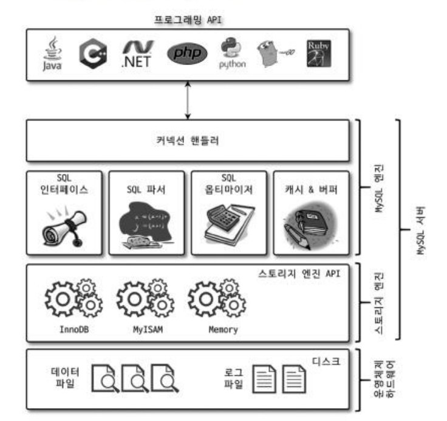

# RealMySQL 4강 아키텍처

# MySQL 엔진 아키텍쳐

## MySQL 구조

> MySQL은 다른 DBMS에 비해 구조가 상당히 독특하며, 이로 인해 다른 DBMS와 차이가 발생한다.
> 

- `MySQL 엔진`
    - 커넥션 핸들러
    - SQL 인터페이스
    SQL 파서
    SQL 옵티마이저
    캐시 & 버퍼

- `스토리지 엔진`
    - 기본적으로 InnoDB 스토리지 엔진, MyISAM 스토리지 엔진을 제공
    - `핸들러 API`를 만족하면 누구든 스토리지 엔진 구현해 사용 가능

### MySQL 엔진

: 요청된 SQL 문장을 분석, 최적화하는 역할

- 주요 구성
    - 커넥션 랜들러 : 클라이언트로부터의 접속 및 쿼리 요청을 처리
    - SQL 파서 & SQL 전처리기
    - 옵티마이저 : 쿼리의 최적화된 실행을 위한 장치

### 스토리지 엔진

: 실제 데이터를 디스크 스토리지에 저장하거나 디스크 스토리지로부터 데이터를 읽어오는 역할

- 여러개를 동시에 사용할 수 있음
(테이블이 사용할 스토리지 엔진 지정 가능)
    
    `CREATE TABLE 테이블명 (fd1 INT, fd2 INT) ENGINE=스토리지엔진;`
    
- MySQL에 기본적으로 내장된 엔진은 성능 향상을 위해 기능을 내장하고 있음
(MyISAM - 키 캐시 / InnoDB - InnoDB 버퍼풀)
- 핸들러 API
    
    : MySQL 엔진의 쿼리 실행기에서 데이터를 쓰거나 읽을 때 각 스토리지 엔진에 보내는 요청
    
    - 레코드 작업 종류 확인 명령어 : `SHOW GLOBAL STATUS LIKE 'Handler%';`

## MySQL 서버는 스레드 기반으로 작동한다.

> 프로세스 기반이 아닌 스레드 기반으로 동작하는 MySQL은 크게
포그라운드와 백그라운드 스레드로 구분할 수 있다.
> 
- 실행 중 스레드 목록 확인 명령어 : `SELECT thread_id, name, type, processlist_host FROM 데이터베이스이름.테이블 이름`
    - 목록 중 동일한 이름의 스레드가 2개 이상 보이는 것의 의미 : MySQL 서버 설정에 따라 여러 스레드가 동일 작업을 병렬적으로 처리하는 것
    - 스레드 중 사용자의 요청을 처리하는 포그라운드 스레드 : `thread/sql/one_connection`

### 포그라운드 스레드 (클라이언트 스레드)

- 각 클라이언트 사용자가 요청하는 쿼리 문장 처리
데이터를 MySQL 데이터 버퍼나 캐시/없을 경우 직접 디스크 데이터나 인덱스 파일로부터 데이터를 읽어와 작업 처리
- 포그라운드 스레드는 최소한 MySQL 서버에 접속된 클라이언트 수만큼 존재
작업 및 커넥션 종료 시 스레드는 다시 스레드 캐시로 돌아감
- 스레드 캐시의 최대 유지 가능 스레드 개수는 시스템 변수 `thread_cache_size`를 통해  설정할 수 있으며, 이 값을 넘어갈 경우 캐시에 넣는 것이 아닌 스레드 종료가 발생

### 백그라운드 스레드 (InnoDB 기준)

- 인서트 버퍼를 병합하는 스레드
- 로그를 디스크로 기록하는 스레드
- InnoDB 버퍼 풀의 데이터를 디스크에 기록하는 스레드
- 데이터를 버퍼로 읽어오는 스레드
- 잠금이나 데드락을 모니터링하는 스레드

## 메모리 할당 및 사용 구조

- MySQL에서 사용되는 메모리 공간
(스레드가 공유해서 사용하는 공간인지 여부에 따라 구분)
    - 글로벌 메모리 영역
        - 일반적으로 클라이언트 스레드의 수와 무관하게 1개 ~ 2개 메모리 공간만 할당
        - 모든 스레드에 의해 공유되는 영역
        (테이블 캐시, InnoDB 버퍼 풀, InnoDB 어댑티브 해시 인덱스, InnoDB 리두 로그 버퍼)
    - 로컬 메모리 영역 (=세컨 메모리 영역)
        - MySQL 서버 상 존재하는 클라이언트 스레드가 쿼리를 처리하는데 사용하는 메모리 영역
            
            클라이언트 스레드가 사용하는 메모리 공간이라서 클라이언트 메모리 영역이라고도 함
            세션(클라이언트와 MySQL 서버와의 커넥션) 메모리 영역이라고도 함
            
        - 클라이언트 스레드별로 독립적으로 할당되며 절대 공유되어 사용되지 않음
        - 커넥션이 열려있는 동안 계속 할당된 상태로 남아있기도 하며 쿼리 실행 순간에만 할당했다가 해제하는 공간도 존재한다
        - 대표 영역 : 정렬 버퍼, 조인 버퍼, 바이너리 로그 캐시, 네트워크 버퍼

## 플러그인 스토리지 엔진 모델

(MySQL의 독특한 구조 중 대표적인 것)

: 데이터베이스의 저장소 계층을 모듈화한 아키텍쳐

- MySQL은 다양한 스토리지 엔진을 플러그인 형태로 추가하거나 교체할 수 있다
(각 테이블마다 서로 다른 스토리지 엔진을 사용할 수 있다)
- 이점
    - MySQL은 플러그인 스토리지 모델을 이용해 다양한 사용 사례에 맞는 스토리지 방식을 선택할 수 있는 유연성을 제공한다.
    - 플러그인 형태의 스토리지 엔진은 손쉽게 업그레이드 가능하다
    - 인증이나 전문 검색 파서, 쿼리 재작성과 같은 플러그인 뿐만 아니라 비밀번호 검증, 커넥션 제어 등에 관련된 플러그인도 제공한다
- 플러그인 항목 확인 명령어 : `SHOW PLUGINS`
- MySQL 8.0부터는 기존의 플러그인 아키텍처를 대체하기 위해 컴포넌트 아키텍쳐가 지원된다.
    
    이는 기존의 몇가지 단점 (플러그인끼리 통신 불가, 캡슐화되지 않은 변수나 함수 호출, 초기화 어려움)을 해결한다.
    

## 쿼리 실행 구조

> 쿼리 실행 관점에서 MySQL을 살펴보면
`쿼리 파서 → 전처리기 -> 옵티마이저 -> 쿼리 실행기`의 구조를 갖는다
> 

### 쿼리 파서

: 사용자 요청으로 들어온 쿼리 문장을 토큰(MySQL이 인식할 수 있는 최소 단위의 어휘나 기호)으로 분리해 트리 형태의 구조로 만들어내는 작업

- 쿼리 문장의 기본 문법 오류 발견 + 사용자에게 오류 메시지 전달 시점

### 전처리기

: 파서 과정에서 만들어진 파서 트리를 기반으로 쿼리 문장에 구조적인 문제점이 있는지 확인하는 작업

- 각 토큰을 테이블 이름이나 칼럼 이름, 내장 함수와 같은 개체를 매핑해 해당 객체의 존재 여부와 객체의 접근 권한 등을 확인하는 과정을 수행
- 실제 존재하지 않거나 권한 상 사용할 수 없는 개체의 토큰을 걸러냄

### 옵티마이저

: 사용자의 요청으로 들어온 쿼리 문장을 저렴한 비용으로 가장 빠르게 처리할지를 결정하는 역할
(중요하고, 영향 범위 또한 아주 넓음)

### 실행 엔진

: 옵티마이저의 결정 결과에 따라 각 핸들러에게 요청해서 받은 결과를 또 다른 핸들러 요청의 입력으로 연결하는 역할

- 핸들러 : MySQL 서버의 가장 밑단에서 MySQL 실행 엔진의 요청에 따라 데이터를 디스크로 저장하고 디스크로부터 읽어오는 역할을 담당
(= 스토리지 엔진)

### CF. 없어진 기능 - 쿼리 캐시

: SQL의 실행 결과를 메모리에 캐시하고 동일 SQL 쿼리가 실행되면 테이블을 읽지 않고 즉시 결과를 반환하기 때문에 빠른 성능을 보임

- 테이블 데이터가 변경되면 캐시에 저장된 결과 중 변경된 테이블 관련 내용 삭제 → 성능 저하
    
    ⇒ MySQL 8.0 올라오며 기능 제거
    (데이터 변경 없이 읽기만 하는 서비스에서는 용이했으나 실제 도움이 된 상황은 거의 없음이 이유)
    

### CF. 제한적 제공 기능 - 스레드 풀

: MySQL  서버 엔터프라이즈 에디션에서 제공하는 기능

- 커뮤니티 에디션에서 스레드 풀 기능을 사용하려면 Percona Server에서 스레드 풀 플러그인 라이브러리를 설치해서 사용
- 목적 : 내부적으로 사용자의 요청을 처리하는 스레드 개수를 줄여서 동시 처리되는 요청이 많더라도 MySQL 서버의 CPU가 제한된 개수의 스레드 처리만 집중할 수 있게 함 ⇒ 서버의 자원 소모 줄이기
- 이점 : 제한된 수의 스레드만으로 CPU가 처리하도록 적절히 유도할 경우 CPU의 프로세서 친화도를 높이고 운영체제 입장에서 불필요한 컨텍스트 스위치를 줄일 수 있음 (오버헤드 감소)
- 주의 : 스케줄링 과정에서 CPU 시간을 제대로 확보하지 못하는 경우 쿼리 처리가 더 느려지는 사례 발생

# InnoDB 스토리지 엔진 아키텍처

(InnoDB : MySQL 스토리지 엔진 가운데 가장 많이 사용)

## InnoDB의 주요 특징

- InnoDB의 모든 테이블은 기본적으로 프라이머리 키를 기준으로 클러스터링되어 저장된다.
    
    (= 프라이머리 키 값의 순서대로 디스크에 저장된다)
    
    - 세컨더리 인덱스는 레코드의 주소 대신 프라이머리 키의 값을 논리적인 주소로 사용한다
    - MyISAM 스토리지 엔진에서는 클러스터링 키를 지원하지 않아 프라이머리 키와 세컨더리 인덱스 사이 구조적 차이가 없다
- 외래키에 대한 지원은 InnoDB 스토리지 엔진 레벨에서 지원하는 기능이다
(MyISAM, MEMORY 테이블에서 사용 불가)
    - InnoDB에서 외래키는 부모 테이블과 자식 테이블 모두 해당 칼럼에 인덱스 생성이 필요하며,
    변경 시 반드시 부모 테이블이나 자식 테이블에 데이터가 있는지 체크하는 작업이 필요하다
        
        ⇒ 잠금이 여러 테이블로 전파, 데드락 발생 가능성 높음 (주의)
        
- 언두 로그를 이용한 MVCC 구현 ⇒ 잠금 없는 일관된 읽기 작업 수행
    - MVCC (Multi Version Concurrency Control)
    : 레코드 레벨의 트랜잭션을 지원하는 DBMS가 제공하는 기능
        - 목적 : 잠금을 사용하지 않는 일관된 읽기를 제공
    - 잠금을 걸지 않기 때문에 InnoDB에서 읽기 작업은 다른 트랜잭션이 가지고 있는 잠금을 기다리지 않고 읽기 작업이 가능하다
        - 주의 : 활성된 트랜잭션 → 일관된 읽기를 위해 언두 로그를 삭제하지 못하고 계속 유지해야 할 경우 서버가 느려지거나 문제가 발생할 수 있음
            
            ⇒ 트랜잭션이 시작됐다면 가능한 한 빨리 롤백이나 커밋을 통해 트랜잭션을 완료할 것
            
- 잠금 대기 목록을 그래프 형태로 관리 + 데드락 감지 스레드가 주기적으로 잠금 대기 그래프 검사해 교착 상태에 빠진 트랜잭션 강제 종료
    - 강제 종료 순서 기준 : 언두 로그의 양 (언두 로그 적게 가진 트랜잭션이 롤백의 대상이 됨)
        - 언두 레코드를 적게 가졌기에 롤백을 해도 언두 처리할 내용이 적음 + MySQL 서버 부하 덜 발생
- innodb_force_recovery 시스템 변수를 통한 자동화된 장애 복구
    - MySQL 서버 시작 시 InnoDB 스토리지 엔진이 데이터 파일이나 로그 파일의 손상 여부 검사 과정을 선별적으로 진행할 수 있도록 함

### InnoDB 버퍼풀

: 디스크의 데이터 파일이나 인덱스 정보를 메모리에 캐시해두는 공간
(+ 쓰기 작업을 지연시켜 일괄 작업으로 처리할 수 있게 해주는 버퍼 역할 같이 함)

- 크기 설정 : 운영체제와 각 클라이언트 스레드가 사용할 메모리 고려해서 설정 필요
(동적 조절 가능하기에 적절히 작은 값으로 설정해서 상황 봐가면서 증가시키는게 베스트)
- 구조 : 3개의 자료구조를 관리
    - LRU (Least Recently Used) 리스트 : 디스크로부터 한번 읽어온 페이지를 최대한 오랫동안 유지해서 디스크 읽기를 최소화 하기 위함
    - 플러시 리스트 : 디스크로 동기화되지 않은 데이터를 가진 데이터 페이지의 변경 시점 기준 페이지 목록 관리 (한번이라도 변경이 가해진 데이터 페이지 관리)
        - 특정 시점 이후 디스크로 기록되어야 함
    - 프리 리스트 : InnoDB 버퍼풀에서 실제 사용자 데이터로 채워지지 않는 비어있는 페이지 목록
    (사용자 쿼리가 새롭게 디스크의 데이터 페이지를 읽어와야 하는 경우 사용)
- 버퍼풀과 리두로그의 관계
    - 버퍼풀은 서버의 메모리가 허용하는 만큼 설정할수록 쿼리 성능이 빨라짐 ⇒ 데이터 캐시 기능 향상
    - 쓰기 버퍼링 기능 향상을 위해서는 리두 로그와의 관계를 이해해야 함
- 버퍼풀은 쿼리의 성능에 매우 밀접하게 연결되어 있다
    - 워밍업 : 디스크의 데이터가 버퍼풀에 적재돼 있는 상태
    - 수동 버퍼풀 백업 + 복구
        - 백업 : ib_buffer_pool 파일 확인
            - 각 테이블의 데이터 페이지르 다시 읽어야 하기에 시간이 걸릴 수 있음
            - 복구 과정 상태 확인 명령어 : `SHOW STATUS LIKE Innodb_buffer_pool_dump_status`
        - 복구 중단 : innodb_buffer_pool_load_abort 시스템 변수 ON 처리
    - 자동 버퍼풀 백업 + 복구
        
        : InnoDB 스토리지 엔진은 MySQL 서버가 셧다운 되기 직전에 버퍼 풀의 백업을 실행하고 MySQL 서버가 시작되면 자동으로 백업된 버퍼 풀의 상태를 복구할 수 있는 기능을 제공한다.
        
        - 관련 설정 : innodb_buffer_pool_dump_at_shutdown / innodb_buffer_pool_load_at_startup
    - 버퍼풀 적재 내용 확인
        
        : information_schema 데이터베이스 내 innodb_cached_indexes 테이블 확인
        
        (인덱스별 데이터 페이지가 얼마다 적재되어 있는지 확인 가능)
        

### 언두 로그

: 트랜잭션과 격리 수준 보장을 위해 DML로 변경되기 이전 버전의 데이터를 백업해둔 것

- 사용 케이스
    - 트랜잭션 보장 (트랜잭션의 롤백 대비용) : 트랜잭션이 롤백되면 트랜잭션 도중 변경된 데이터를 변경 전 데이터로 복구해야 하는데 이 때 언두 로그에 백업해둔 이전 버전의 데이터를 이용해 복구
    - 격리 수준 보장 (높은 동시성 제공) : 특정 커넥션에서 데이터를 변경하는 도중 다른 커넥션에서 데이터를 조회하면 트랜잭션 격리 수준에 맞게 변경 중인 레코드를 읽지 않고 언두 로그에 백업해둔 데이터를 반환
- 문제점 : 관리 비용이 많이 필요함
    - 서버별로 안정적인 시점의 언두 로그 레코드 건수를 확인해 이를 기준으로 언두 로그의 급증 여부를 모니터링하는 것이 좋음
        - 언두 테이블스페이스 : 언두 로그가 저장되는 공간
            
            (MySQL 8.0 이전에는 시스템 변수로 관리됐으나 8.0 이후에는 외부의 별도 로그 파일에 기록되도록 개선됨)
            
        - Undo tablespace truncate : 언두 테이블스페이스 공간을 필요한만큼 남기고 불필요하거나 과도하게 할당된 공간을 운영체제로 반납하는 것
            - 자동 방법 : 트랜잭션 커밋 이후 퍼지 스레드가 주기적으로 불필요해진 언두 로그를 삭제
                
                ⇒ 언두 퍼지
                
            - 수동 모드 : innodb_undo_log_truncate 시스템 변수를 OFF (INACTIVE)

### 체인지버퍼

: 변경해야 할 인덱스 페이지가 버퍼풀이 아닌 디스크에 있을 경우 즉시 실행하지 않고 저장하는 임시 메모리 공간

- 체인지 버퍼 저장 후 사용자에게는 바로 결과를 반환함
- 임시 저장된 레코드 조각은 버퍼 머지 스레드 (백그라운드 스레드)에 의해 병합
- 체인지 버퍼는 기본적으로 버퍼 풀로 설정된 메모리 공간의 25% 사용 가능하게 설정
추가적으로 50%까지 설정 가능

### 리두 로그

: 하드웨어나 소프트웨어 등 여러가지 문제점으로 인해 MySQL 서버가 비정상적으로 종료됐을 떄 데이터 파일에 기록되지 못한 데이터를 잃지 않게 해주는 안전 장치

- 로그 파일 크기 및 개수 설정
    - innodb_log_file_size : 크기
    - innodb_log_file_in_group : 개수
    
    ⇒ 전체 크기는 두 변수의 곱으로 결정
    
- 리두로그 아카이빙 : 스토리지 엔진의 리두 로그에 쌓인 내용을 계속 추적하면 서새롭게 추가된 리두 로그 엔트리를 복사
- 리두 로그 활성화 및 비활성화 : MySQL 서버 트랜잭션 커밋될 경우 데이터 파일은 즉시 디스크 동기화되지 않지만 리두 로그는 항상 디스크로 기록됨

<aside>
💡

InnoDB, MyISAM, MEMORY 스토리지 엔진 비교

- MySQL 8.0 업그레이드되면서 MySQL 서버 모든 시스템 테이블이 InnoDB 스토리지 엔진으로 교체
- MyISAM 스토리지 엔진 기능은 도태되지 상황이며, 이후 버전에서 없어질 것으로 예상
- MEMORY 스토리지 엔진은 이전 버전과의 호환성 유지 차원에서 남을 뿐 향후 버전에서 제거될 것으로 예상
</aside>

# MyISAM 스토리지 엔진 아키텍쳐

## 키 캐시 (키 버퍼)

: InnoDB의 버퍼풀과 비슷한 역할을 하는 것

- 키 캐시 대상 : 인덱스
- 인덱스의 디스크 쓰기 작업에 대해서만 부분적으로 버퍼링 역할을 함

## 운영체제의 캐시/버퍼

- MyISAM 스토리지 엔진은 디스크로부터의 I/O를 해결해줄만한 캐시나 버퍼링 기능을 갖고 있지 않기 때문에 운영체제의 디스크 읽기 또는 쓰기 작업으로 요청될 수 밖에 없음
- 운영체제의 캐시 공간은 남는 메모리를 사용하는 것이 기본 원칙이기에,
운영체제가 캐시 용도로 사용할 수 있는 메모리 공간이 없을 경우 MyISAM 테이블 데이터 캐시를 못해 쿼리 처리 느려질 수 있음

## 데이터 파일과 프라이머리 키(인덱스) 구조

- 프라이머리 키에 의한 클러스터링 없이 데이터 파일이 힙 공간처럼 사용됨
(키값과 무관하게 INSERT 순서대로 데이터 파일에 저장)

# MySQL 로그 파일

## 에러 로그 파일

: MySQL이 실행되는 도중 발생하는 에러나 경고 메시지가 출력되는 로그 파일

- 위치
    - 별도 정의 : MySQL 설정 파일 내 log_error 이름의 파라미터로 정의된 경로에 생성
    - 별도 정의 X : 데이터 디렉터리 .err 확장자 파일로 생성
- 메시지 종류
    - MySQL 시작 과정 관련 정보성 및 에러 메시지
    서버 정상 기동 : `mysqld: ready for connection` 메시지 확인
    - 마지막 종료 시 비정상적 종료의 경우 InnoDB 트랜잭션 복구 메시지
    - 쿼리 처리 도중 발생하는 문제에 대한 에러 베시지
    - 비정상적으로 종료된 커넥션 메시지
    - InnoDB 모니터링 또는 상태 조회 명령의 결과 메시지
    - MySQL 의 종료 메시지
        - 타인의 서버 종료 : Received SHUTDOWN from user …
        - 비정상적 종료 (세그먼테이션 폴트) : 아무런 종료 관련 베시지 없음 + 스택 트레이스 출력
    - 제너럴 쿼리 로그 파일 (제너럴 로그 파일)
        - 쿼리 로그 파일 경로 : general_log_file 이름의 파라미터에 설정되어 있음
    - 슬로우 쿼리 로그 & 슬로우 쿼리 통계
    - 쿼리별 실행 횟수 및 누적 시간 상세 정보

# 학습 후기

- MySQL의 구조 개괄을 볼 때만 하더라도 흥미로웠다. 하지만 InnoDB 아키텍처 들어가면서 머리가 벙찜
- 로그 파일 관련해서는 직접 찍어보고 해봐야 알 것 같다.