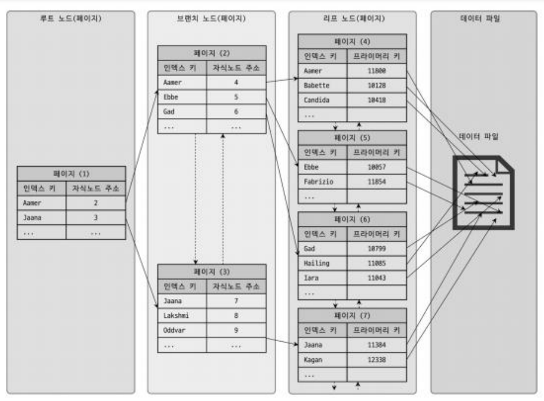

# RealMySQL 8장. 인덱스

- 목차

> MySQL에서 사용 가능한 인덱스의 종류 및 특성
> 
> - 활용 : 물리 수준의 모델링을 할 때 각 인덱스의 특성과 차이를 알면 도움이 됨
> 
> ⇒ 인덱스는 쿼리 튜닝의 기본이 되는 내용이자, 인덱스에 대한 기본 지식은 개발자, 관리자에게 중요함
> 

## 디스크 읽기 방식

> 데이터베이스의 성능 튜닝은 어떻게 디스크 I/O를 줄이느냐가 관건인 경우가 많다
> 

### 데이터베이스 서버에서 디스크 장치가 병목이 되는 이유
(+ DBMS용 서버에 SSD를 많이 사용하는 이유)

- CPU, 메모리 등의 주요 장치는 전자식이지만, HDD는 기계식 장치이기 때문
    
    ⇒ 데이터 저장용 플래터(원판)을 제거하고 플래시 메모리를 장착한 전자식 저장 매체 SSD 사용
    
- SSD 장점
    - 디스크 원판 회전 필요 X, 데이터 빠른 RW 가능, 비휘발성 메모리, HDD보다 빠른 성능
    - 순차 I/O (디스크 헤더 움직임 X, 많은 데이터 RW)에서 HDD보다 조금 빠르거나 비슷한 성능
    + DB 서버에서 비중이 큰 랜덤 I/O (작은 데이터 RW)에서 HDD보다 훨씬 빠름
        
        ⇒ DBMS용 스토리지에 최적화된 선택지
        

### 순차 I/O와 랜덤 I/O

- 공통점
    
    : 두 작업의 과정은 `원판 이동 → 디스크 헤더 이동 → 데이터 읽기/쓰기 → 동기화`로 동일하다.
    
- 차이점
    - HDD에서의 디스크 헤드의 움직임 횟수 : 순차 I/O는 1회, 랜덤 I/O는 페이지 개수만큼 이동
        
        ⇒ 랜덤 I/O에서의 작업 부하가 더 큼
        (디스크의 성능은 헤더 위치 이동 없이 한번에 얼마나 많은 데이터를 기록하느냐)
        
        ⇒ MySQL 서버에서는 그룹 커밋이나 바이너리 로그 버퍼, InnoDB 로그 버퍼 등 내장
        
    - SSD에서의 전체 스루풋 : 순차 I/O보다 랜덤 I/O의 전체 스루풋이 떨어짐
- 쿼리 튜닝 : 랜덤 I/O 자체를 줄여주는 것이 목적 (쿼리 처리에 필요한 데이터만 읽도록 쿼리 개선)

## 인덱스

: 데이터베이스 테이블의 칼럼 값과 레코드가 저장된 주소를 key-value 쌍으로 삼아 만들어둔 색인

- DBMS의 인덱스 역시 칼럼 값을 주어진 순서대로 미리 정렬해서 보관함 (정렬된 상태 유지)
    - 정렬을 해야하기 때문에 데이터의 저장 (Insert, Update, Delete) 성능은 떨어짐
    - 정렬했기 때문에 읽기 속도는 높아짐
    - 칼럼에 전부 인덱스를 생성할 경우 데이터 저장 성능은 떨어지고 인덱스 크기는 비대해져 비효율적

### 인덱스의 역할별 구분 : 프라이머리 키 & 세컨더리 키 (보조키, 세컨더리 인덱스)

- 프라이머리 키 : 레코드를 대표하는 칼럼 값으로 만들어진 인덱스
    - 레코드 식별의 기준값이 됨 ⇒ 식별자라고 부름
    - NULL 값 허용 안함 + 중복 허용 안함
- 세컨더리 키 : 프라이머리 키를 제외한 모든 인덱스

### 인덱스의 정렬 알고리즘별 구분 : B-Tree 인덱스 & Has스

- B-Tree 인덱스 알고리즘 : 칼럼의 값을 변형하지 않고 원래 값을 이용해 인덱싱
    - 가장 일반적으로 사용되는 인덱스 알고리즘
    - 장점 : 빠른 검색을 지원
    - 단점 : INSERT, DELETE, UPDATE 작업에서 인덱스 관리에 대한 추가 비용을 감당해야 함
    - MySQL에서 위치 기반 검색을 지원하기 위한 R-Tree 역시 B-Tree 응용 알고리즘으로 볼 수 있음
    - 대부분의 인덱스는 B-Tree에 사용할 정도로 일반적인 용도에 적합한 알고리즘
- Hash 인덱스 알고리즘 : 칼럼의 값으로 해시값을 계산해서 인덱싱하는 알고리즘
    - 장점 : 매우 빠른 검색을 지원
    - 단점 : 전방 일치와 같은 값의 일부 검색, 범위 검색에 사용 불가 (값을 변형해서 인덱싱하기 때문)
    - 활용 : 메모리 기반의 DB에서 많이 활용

### 그 외의 구분

- 유니크 인덱스와 논 유니크 인덱스 (데이터 중복 허용 여부를 기준으로 한 구분)
    - 유니크 인덱스
        - 프라이머리 키와 성격이 비슷함, 대체 사용 가능
    - 논-유니크 인덱스
    
    ⇒ 데이터 중복 허용 여부는 실제 DBMS 쿼리를 실행해야 하는 옵티마이저에게 있어 중요한 문제가 됨
    (유니크 인덱스는 하나의 레코드만 찾으면 더이상 검색할 필요가 없다는 것을 의미하기 때문)
    
    ⇒ 유니크 인덱스로 인한 MySQL 처리 방식의 변화나 차이점이 많기에 중요
    
- 기능별 분류 : 전문 검색용 인덱스 & 공간 검색용 인덱스

### 데이터 파일의 레코드 저장 기준

- 대부분 RDBMS의 데이터 파일의 레코드는 임의의 순서로 저장된다
(항상 INSERT된 순서로 저장되는 것은 아니다 / 특정 기준으로 정렬되지 않음)
- InnoDB 테이블에서의 레코드는 클러스터되어 디스크에 저장되기에 기본적으로 프라이머리 키 순서로 저장된다
(오라클의 IOT와 MS-SQL의 클러스터 테이블과 같은 구조)
    - 클러스터링 : 비슷한 값을 최대한 모아서 저장하는 방식
        - 다른 DBMS에서는 클러스터링 기능이 선택사항
        - InnoDB에서는 사용자가 별도의 명령이나 옵션을 선택하지 않아도 디폴트로 클러스터링 테이블이 생성됨

## MySQL에서 사용 가능한 인덱스들 - B-Tree 인덱스

: 칼럼의 원래 값을 변형시키지 않고 인덱스 구조체 내에서 항상 정렬된 상태로 유지

(물론 값의 일부분만 잘라서 관리하긴 함)

- B-Tree 인덱스의 리프 노드는 항상 실제 데이터 레코드를 찾아가기 위한 주솟값을 가짐
(데이터베이스에서 인덱스와 실제 데이터가 저장된 데이터는 따로 관리)
    - 인덱스는 테이블의 키 칼럼만 갖기에 나머지 칼럼을 읽기 위해서는 데이터 파일에서 해당 레코드를 찾아와야 함
    
    
    

### B-Tree 인덱스의 장단점

- 장점
    
    : 정렬된 상태를 유지해 범위 검색이 효율적임 / 특히 전방 일치 검색에 효율적 / 데이터 중복값 허용
    
- 단점
    
    : 쓰기 작업에서 오버 헤드 발생 / 인덱스 키 크기 클수록 메모리 사용량 증가 / 전방 일치 외 검색에 인덱스 활용 불가 / 인덱스 개수가 많을수로고 추가 디스크 공간 필요
    
- 일반적인 DBMS의 B-Tree는 자식 노드의 개수가 가변적인 구조를 갖고 있다 (이진트리 아님)
- 인덱스와 데이터 파일 관계
    - MyISAM 테이블
        - 레코드 주소
        : 테이블 생성 옵션에 따라 레코드가 테이블에 INSRT된 순번 or 데이터 파일 내 위치 (Offset)
        - 세컨터리 인덱스를 통해 데이터 파일 레코드를 찾아갈 경우,
        세컨더리 인덱스는 물리적인 주소를 가짐
    - InnoDB에서의 인덱스와 데이터 파일의 관계
        - ROWID : 프라이머리 키
        - 세컨더리 인덱스를 통해 데이터 파일 레코드를 찾아갈 경우,
        프라이머리 키를 주소처럼 사용 (논리적인 주소를 가짐)
        - 데이터 파일을 바로 찾아가지 못하고, 프라이머리 키 인덱스 검색 후 리프 페이지 레코드를 읽음
        (세컨더리 인덱스 검색에서 프라이머리 키 저장 B-Tree를 한번 더 검색해야 함)

### MySQL B-Tree 인덱스의 CRUD

- B-Tree 인덱스 키 추가
    - B-Tree는 상대적으로 쓰기 작업(새로운 키 추가)에 비용이 많이 든다고 알려져 있다
        
        : 리프 노드가 꽉 차서 저장이 안될 경우 리프 노드가 분리되엉야 하는데 처리 범위가 상위 브랜치 노드까지 넓어지기 때문
        
    - MyISAM과 MEMORY 엔진
        
        : INSERT 문장 실행 시 즉시 새로운 키 값을 B-Tree 인덱스에 반영
        
    - InnoDB 엔진
        
        : 프라이머리 키나 유니크 인덱스의 경우 중복 체크가 필요하기에 즉시 B-Tree에 추가 또는 삭제
        
        (그 외의 경우 필요하다면 인덱스 키 추가 작업을 지연시켜 나중에 처리할 수 있음)
        
- B-Tree 인덱스 키 삭제
    - 해당 키 값이 저장된 리프 노드를 찾아서 삭제 마크 처리를 진행한다
    (삭제 마킹된 인덱스 키 공간은 방치 또는 재활용 가능)
    - 인덱스 키 삭제로 인한 마킹 작업은 디스크 쓰기가 필요하기에 디스크 I/O가 필요하다
        - MyISAM, MEMROY 엔진 : 체인지 버퍼와 같은 기능이 없기에 인덱스 삭제 후 쿼리 실행 완료됨
        - InnoDB (MySQL 5.5 이상) : 버퍼링되어 지연 처리될 수 있음 (서버 내부적 처리, 사용자 영향 X)
    - 체인지 버퍼 : InnoDB 메모리 영역의 일부로, 보조 인덱스 페이지가 버퍼 풀에 없을 때 변경 사항을 임시로 저장하는 공간
        - 목적 : 디스크 I/O 작업 최소화와 인덱스 변경  작업 효율성 향상
- B-Tree 인덱스 키 변경
    - B-Tree의 키 값 변경은 `키 값 삭제 → 새로운 키 값 추가`로 진행된다
    (키값에 따라 리프노드의 위치가 결정되기에 단순히 인덱스 상 키 값 변경은 불가능하기 때문)
    - 삭제 작업을 거치기 때문에 InnoDB를 사용하는 테이블의 경우 체인지 버퍼를 활용해 지연 처리 가능
- B-Tree 인덱스 키 검색
    - 트리 탐색 (루트노드부터 시작해 브랜치 노드를 거쳐 리프 노드까지 이동)
    - 활용 : 100% 일치 또는 값의 앞부분이 일치하는 경우 사용 가능
    (키 값의 뒷부분만 검색하는 용도로 인덱스 사용 불가)
    - 함수나 연산 수행 결과로 정렬 또는 검색과 같이 인덱스 키 값에 변형이 가해진 후에 비교될 경우 B-Tree의 빠른 검색 기능 사용 불가
    (값이 변형되는 것은 B-Tree 인덱스에 존재하는 값이 아니기 때문)
    - InnoDB에서의 인덱스 검색
        - 동작 순서
        (데이터 일관성 보장 / 명확한 잠금 순러를 통한 데드락 방지 및 동시성 제어 용이)
            1. 인덱스 키를 이용해 검색
            2. 검색된 인덱스에 대한 잠금 설정 (레코드 락 또는 넥스트 키락 이용)
            3. 실제 레코드 조회
        - 인덱스 설계를 주의해야 하는 이유
            
            : UPDATE, DELE 문장 실행 시 조회가 필요한데 적절하게 사용할 인덱스가 없을 경우 불필요하게 많은 레코드를 잠글 수 있기 때문
            
        - MyISAM이나 MEMORY는 테이블 레벨 잠금만 지원하고, 인덱스 단위의 잠금은 지원하지 않음
        (세밀한 동시성 제어에 어려움이 있음)

### B-Tree 인덱스 사용에 영향을 미치는 요소

- 인덱스 키 값의 크기
    - 인덱스 키 값이 커지면
    디스크로부터 읽어야 하는 횟수 증가 → 속도 저하
        - MySQLd의 B-Tree 자식 노드 개수는 인덱스 페이지 크기와 키 값의 크기에 따라 결정된다
        (페이지 : 디스크 저장 기본 단위이자 읽기/쓰기 작업 최소 단위로 활용)
        - 따라서 인덱스 키 값이 커질 경우 B-Tree의 저장 가능한 자식 노드 개수 감소
    - 인덱스 키 값이 커지면
    전체적인 인덱스 크기 증가 → 인덱스 캐시 가능 레코드 수 감소 → 메모리 효율 감소
- B-Tree의 깊이
    - 깊이가 깊을수록 디스크 읽기 횟수 증가
    - 보통 3~4 레벨이면 수천만 건의 레코드 저장 가능
    - 키 값이 커지면 깊이도 증가하는 경향
- 선택도 (기수성)
    - 인덱스 칼럼의 유니크한 값의 수
    - 선택도가 높을수록(중복이 적을수록) 검색 효율성 증가
    - PK나 UNIQUE 인덱스가 가장 선택도가 높음
- 읽어야 하는 레코드의 건수
    - 인덱스를 통해 읽어야 할 레코드가 전체의 20~25% 넘어가면
    - 인덱스 사용하지 않고 풀 테이블 스캔이 유리할 수 있음

### B-Tree 인덱스를 통한 데이터 읽기

- 인덱스 레인지 스캔
    - 가장 대표적인 접근 방식
    - 검색해야 할 인덱스의 범위가 결정됐을 때 사용
    - 루트 노드부터 리프 노드까지 트리 탐색 후 필요한 범위만 스캔
- 인덱스 풀 스캔
    - 인덱스의 처음부터 끝까지 모두 읽는 방식
    - 테이블 풀 스캔보다는 효율적
    - 정렬된 인덱스를 순서대로 읽을 때 사용
- 루스 인덱스 스캔
    - 인덱스 탐색 중 필요없는 인덱스 키 값은 건너뛰는 방식
    - GROUP BY 또는 집계 함수 최적화에 사용
- 인덱스 스킵 스캔
    - MySQL 8.0부터 도입
    - 복합 인덱스의 선행 칼럼이 조건절에 없어도 인덱스 활용 가능

### B-Tree 다중 칼럼 인덱스

> 실제 서비스용 데이터 베이스에서는 2개 이상의 칼럼을 포함하는 경우가 많기에 알아둬야 함
> 
- 주요 특징:
    - 두 개 이상의 칼럼으로 구성된 인덱스
    - 칼럼 순서가 매우 중요
    - 왼쪽 칼럼부터 순서대로 참조됨
    - 첫 번째 칼럼 조건 없이는 인덱스 효율이 떨어짐

### B-Tree 인덱스의 정렬 및 스캔 방향

- B-Tree 인덱스의 정렬
    - 인덱스는 항상 정렬된 상태 유지
    - 오름차순/내림차순 지정 가능
    - 여러 칼럼의 정렬 순서를 다르게 지정 가능
- B-Tree 인덱스의 스캔 방향
    - 정방향(Forward) / 역방향(Backward) 스캔 가능
    - MySQL 옵티마이저가 적절한 방향 선택
- 내림차순 인덱스
    - MySQL 8.0부터 지원
    - DESC 정렬에 최적화

### B-Tree 인덱스의 가용성과 효율성

- 비교 조건의 종류와 효율성
    - 등호(=) 비교가 가장 효율적
    - 범위 조건(>, <)은 그 이후 칼럼은 인덱스 활용 못함
    - LIKE '%text'는 인덱스 활용 불가
- 인덱스의 가용성
    - WHERE, GROUP BY, ORDER BY 절에서 사용 가능
    - 조인 조건으로 사용 가능
    - 커버링 인덱스의 경우 데이터 파일 접근 불필요

## MySQL에서 사용 가능한 인덱스들 - 그 외

### R-Tree 인덱스

- 공간 데이터를 인덱싱하기 위한 특수한 인덱스 구조
- 2차원의 데이터를 인덱싱하고 검색하는 목적
- 주로 GPS 기반 위치 검색, 지도 응용 프로그램에서 사용
- MySQL의 공간 확장(Spatial Extension)을 사용할 때 이용됨
- POINT, LINE, POLYGON 같은 공간 데이터 타입을 위한 인덱스

### 전문 검색 (Full Text Search) 인덱스

- 문서 전체에서 키워드를 검색하는데 사용
- 게시글 내용, 제품 설명과 같은 긴 문자열 칼럼을 대상으로 함
- 구현 방식:
    - 불용어(Stopwords) 처리: 검색어로써 가치가 없는 단어 제외
    - 형태소 분석: 검색어의 의미를 분석하여 정확도 향상
- MATCH ... AGAINST 구문으로 검색 수행
- InnoDB와 MyISAM 모두 지원

### 함수 기반 인덱스

- 칼럼의 값을 변형해서 만든 인덱스
- 활용 사례:
    - 대소문자 구분없는 검색을 위해 LOWER() 함수 사용
    - 날짜의 일부만 추출해서 인덱싱
- MySQL 8.0부터 함수 기반 인덱스 공식 지원
- 실제 칼럼의 값이 아닌 함수의 결과값을 인덱싱

### 멀티 밸류 (Multi-Value) 인덱스

- JSON 타입 칼럼의 배열 형태 값을 인덱싱
- MySQL 8.0부터 지원
- JSON 배열의 개별 요소를 별도로 인덱싱
- 활용 예:
    
    ```sql
    sql
    Copy
    CREATE INDEX idx_tags ON table_name ((CAST(data->'$.tags' AS UNSIGNED ARRAY)));
    ```
    

### 클러스터링 인덱스

- 테이블의 프라이머리 키에 대해서만 적용되는 인덱스
- InnoDB의 특징적인 기능
- 특징:
    - 프라이머리 키 순서에 따라 데이터가 물리적으로 정렬됨
    - 테이블당 하나만 존재 가능
    - 프라이머리 키 지정하지 않으면 자동으로 생성
- 장점:
    - 프라이머리 키 기반 범위 검색이 빠름
    - 데이터의 물리적 저장 순서가 정렬되어 있어 I/O 효율적
- 주의사항:
    - 프라이머리 키가 커지면 세컨더리 인덱스도 커짐
    - INSERT 시 데이터 물리적 재배치 발생 가능

### 유니크 인덱스

: 테이블이나 인덱스에 같은 값이 2개 이상 저장될 수 없음 (인덱스라기보다는 제약에 가까움)

- 유니크 인덱스에서의 NULL도 저장될 수 있으며,
NULL은 특정 값이 아니기에 2개 이상 저장될 수 있다.
- MySQL에서의 유니크 인덱스
    - MySQL에서는 인덱스 없이 유니크 제약만 설정할 방법이 없음
    - MySQL에서 프라이머리 키는 기본적으로 NULL을 허용하지 않는 유니크 속성이 자동 부여된다.
- 유니크 인덱스와 세컨더리 인덱스의 비교
    - 인덱스 읽기 : 차이 미비
        - 세컨더리 인덱스에서는 CPU 수준에서 칼럼값 비교 작업이 추가되지만 성능상 영향은 없음
        - 세컨더리 인덱스가 느릴 것이라는 이유의 원인
        : 중복된 값을 허용하기에 읽어야 할 레코드가 많아 느린 것 (읽기 자체가 느린 것은 아님)
    - 인덱스 쓰기 : 유니크 인덱스가 더 느리게 작동
        - 중복값 유무 체크하는 과정이 추가됨
        중복값 체크 과정에서 읽기 잠금 발생, 쓰기 진행 시 쓰기 잠금 사용
            
            ⇒ 데드락이 빈번하게 발생
            
        - InnoDB의 경우 체인지 버퍼를 사용하기에 저장, 변경 작업은 빠르게 처리되지만
        작업 자체를 버퍼링하는 것은 아님
- 유니크 인덱스 사용 시 주의 사항
    - 성능 향상을 기대하며 불필요하게 유니크 인덱스를 생성하지 말 것
    - MySQL의 경우 유니크 이덱스는 일반 인덱스와 같은 역할을 하기에 중복 생성 필요가 없다
    - 동일 칼럼에 대해 프라이머리 키와 유니크 인덱스를 동일하게 생성하는 것 역시 불필요한 중복
    
    ⇒ 유일성이 보장되는 칼럼에 대해서는 유니크 인덱스를 생성하되, 꼭 필요하지 않다면 세컨더리 인덱스 생성도 고려해보자.
    

### 외래키

: MySQL에서 외래키는 InnoDB 스토리지 엔진에서만 생성할 수 있음

- 외래키 제약이 설정될 경우 자동으로 연관되는 테이블의 칼럼에도 인덱스가 생성됨
(외래키가 제거되지 않은 상태에서는 자동으로 생성된 인덱스 삭제 불가)
- InnoDB 외래키 관리의 주요 특징
    - 테이블 변경 (쓰기 잠금) 발생하는 경우에만 잠금 경합 (잠금 대기) 발생
        
        ⇒ 자식 테이블의 외래키 칼럼 변경을 하는 상황에서 부모 테이블의 해당 레코드 잠금 걸릴 경우 대기
        
    - 외래키와 연관 없는 칼럼은 최대한 잠금 경합 (잠금 대기)를 발생시키지 않음
- 데이터베이스에서 외래 키를 물리적으로 생성하려면 잠금 경합까지 고려해 모델링하는 것이 중요하다
    
    ⇒ 잠금이 다른 테이블까지 확장되는 것은 쿼리의 동시 처리에 영향을 미치기 때문
    

## 인덱스 관련 질문 리스트

### 최종

- 데이터베이스에서 인덱스가 필요한 이유
    
    인덱스는 데이터베이스 테이블의 검색 속도를 향상시키기 위한 자료구조입니다. 주요 필요 이유는 다음과 같습니다:
    
    1. 검색 성능 향상
        - 인덱스가 없다면 특정 데이터를 찾기 위해 테이블 전체를 순차적으로 검색(Full Table Scan)해야 합니다
        - 인덱스를 사용하면 B-Tree 구조를 통해 원하는 데이터를 빠르게 찾을 수 있습니다
    2. 정렬 및 그룹화 연산 최적화
        - ORDER BY, GROUP BY 등의 작업을 수행할 때 이미 정렬된 인덱스를 활용하여 성능을 향상시킬 수 있습니다
    3. 데이터 무결성 보장
        - Primary Key, Unique 인덱스를 통해 데이터의 중복을 방지하고 무결성을 보장할 수 있습니다
- Index를 어떤 Column에 사용하는 것이 좋을까요
    
    인덱스는 다음과 같은 기준으로 컬럼을 선정하는 것이 좋습니다:
    
    1. WHERE 절에서 자주 사용되는 컬럼
        - 검색 조건으로 자주 사용되는 컬럼에 인덱스를 생성하면 검색 성능을 크게 향상시킬 수 있습니다
    2. 선택도(Selectivity)가 높은 컬럼
        - 데이터의 중복도가 낮은(고유한 값이 많은) 컬럼이 인덱스로 적합합니다
        - 예: 주민등록번호, 이메일 등
    3. JOIN에 자주 사용되는 컬럼
        - 외래 키로 사용되는 컬럼들은 JOIN 연산의 성능을 위해 인덱스를 고려해야 합니다
    4. ORDER BY, GROUP BY에 자주 사용되는 컬럼
        - 정렬이나 그룹화 작업이 자주 발생하는 컬럼에 인덱스를 생성하면 해당 작업의 성능을 개선할 수 있습니다
    
    단, 컬럼의 데이터 크기가 너무 큰 경우는 신중하게 고려해야 하며, 갱신이 빈번한 컬럼의 경우 인덱스 생성을 피하는 것이 좋습니다.
    
- 인덱스가 많을 때의 장단점은 무엇인가요?
    
    장점:
    
    1. 검색 성능 향상
        - 다양한 조건의 WHERE 절에 대해 빠른 검색이 가능합니다
        - 여러 조합의 검색 조건에 대응할 수 있습니다
    2. 정렬 작업 최적화
        - 다양한 정렬 조건에 대해 인덱스를 활용할 수 있습니다
    
    단점:
    
    1. 추가적인 저장 공간 필요
        - 각 인덱스마다 별도의 저장 공간이 필요합니다
        - 데이터베이스 크기가 증가합니다
    2. 데이터 변경 작업의 성능 저하
        - INSERT, UPDATE, DELETE 작업 시 모든 인덱스를 함께 수정해야 합니다
        - 인덱스가 많을수록 이러한 작업의 부하가 증가합니다
    3. 옵티마이저의 비효율적인 실행 계획 선택 가능성
        - 너무 많은 인덱스가 있으면 옵티마이저가 최적의 실행 계획을 선택하는 데 어려움을 겪을 수 있습니다
- InnoDB의 세컨더리 인덱스가 프라이머리 키를 통해 실제 데이터를 찾는 과정에 대해서 설명해주세요
    
    InnoDB에서 세컨더리 인덥스를 통한 데이터 검색 과정:
    
    1. 세컨더리 인덱스 검색
        - 검색 조건에 해당하는 세컨더리 인덱스 레코드를 찾습니다
        - 세컨더리 인덱스 레코드에는 해당 레코드의 프라이머리 키 값이 저장되어 있습니다
    2. 프라이머리 키를 이용한 클러스터링 인덱스 검색
        - 세컨더리 인덱스에서 찾은 프라이머리 키 값으로 클러스터링 인덱스를 검색합니다
        - 이 과정을 '인덱스 스캔'이라고 합니다
    3. 실제 데이터 접근
        - 클러스터링 인덱스에서 찾은 위치에서 실제 데이터를 읽어옵니다
    
    이러한 과정을 통해 InnoDB는 세컨더리 인덱스를 이용해 데이터를 찾을 때 항상 프라이머리 키를 통한 추가 검색이 필요합니다. 이를 '루즈 인덱스 스캔'이라고도 합니다.
    
- 클러스터링 인덱스와 논클러스터링 인덱스의 차이점과 각각의 장단점을 설명해주세요
    
    클러스터링 인덱스:
    
    - 테이블의 물리적 저장 순서를 인덱스의 순서와 동일하게 유지합니다
    - InnoDB의 경우 프라이머리 키가 클러스터링 인덱스가 됩니다
    - 장점:
        - 인덱스 검색 후 데이터를 찾을 때 추가적인 디스크 I/O가 적습니다
        - 범위 검색 성능이 우수합니다
    - 단점:
        - 물리적 순서를 유지해야 하므로 데이터 입력/수정 시 오버헤드가 발생합니다
        - 테이블당 하나만 생성 가능합니다
    
    논클러스터링 인덱스:
    
    - 데이터의 물리적 저장 순서와 인덱스의 순서가 다릅니다
    - 장점:
        - 여러 개의 인덱스를 생성할 수 있습니다
        - 데이터 입력/수정이 클러스터링 인덱스보다 빠릅니다
    - 단점:
        - 데이터를 찾을 때 추가적인 디스크 I/O가 필요할 수 있습니다
        - 범위 검색 시 성능이 클러스터링 인덱스보다 떨어질 수 있습니다

### 기본

- (심화) 데이터 검색 시 hash table의 시간복잡도가 b+bree보다 빠른데, index가 b+tree로 구현되는 이유
    
    > B-Tree 인덱스와 Hash 인덱스의 방식 차이를 알고 있는가?
    > 
    
    Hash Table이 O(1)의 시간 복잡도로 더 빠른 검색을 제공함에도 B+Tree가 선호되는 이유:
    
    1. 범위 검색 지원
        - Hash Table은 정확한 일치 검색만 가능합니다
        - B+Tree는 범위 검색(BETWEEN, >, < 등)을 효율적으로 지원합니다
    2. 정렬된 데이터 접근
        - B+Tree는 데이터가 정렬된 상태로 저장되어 ORDER BY 연산을 효율적으로 처리할 수 있습니다
        - Hash Table은 정렬 순서를 유지하지 않습니다
    3. 부분 검색 지원
        - B+Tree는 인덱스 컬럼의 앞부분 일부만으로도 검색이 가능합니다(전방 일치 검색)
        - Hash Table은 전체 키에 대한 해시값을 사용하므로 부분 검색이 불가능합니다
    4. 디스크 I/O 최적화
        - B+Tree는 계층적 구조로 인해 디스크 블록 단위의 I/O에 최적화되어 있습니다
- 데이터베이스의 성능 튜닝에서 디스크 I/O가 중요한 이유와 이것이 인덱스 설계에 어떤 영향을 미치는지 설명해주세요
    
    디스크 I/O가 중요한 이유:
    
    1. 성능 차이
        - 메모리 접근: 나노초(10^-9) 단위
        - 디스크 접근: 밀리초(10^-3) 단위
        - 약 100,000배의 성능 차이가 발생합니다
    2. 병목 현상
        - 대부분의 성능 저하는 디스크 I/O에서 발생합니다
        - CPU나 메모리보다 디스크 접근이 훨씬 느립니다
    
    인덱스 설계에 미치는 영향:
    
    1. 인덱스 크기 최적화
        - 인덱스가 메모리에 최대한 캐시될 수 있도록 크기를 고려해야 합니다
        - 불필요한 컬럼을 인덱스에 포함시키지 않아야 합니다
    2. 커버링 인덱스 고려
        - 쿼리가 인덱스만으로 처리될 수 있도록 설계하면 디스크 I/O를 줄일 수 있습니다
    3. 인덱스 선택성 고려
        - 선택도가 높은 컬럼을 선택하여 불필요한 디스크 I/O를 줄여야 합니다

### MySQL 관련

- 인덱스와 데이터 파일 관계를 InnoDB와 MyISAM을 비교해서 설명해주세요.
    
    InnoDB:
    
    1. 클러스터링 인덱스 구조
        - 데이터 파일이 프라이머리 키를 기준으로 정렬되어 저장됩니다
        - 모든 세컨더리 인덱스는 프라이머리 키를 가리킵니다
    2. 데이터 저장 방식
        - 테이블스페이스라는 단위로 데이터를 관리합니다
        - 데이터와 인덱스가 같은 파일에 저장됩니다
    
    MyISAM:
    
    1. 힙 구조
        - 데이터 파일이 정렬되지 않은 상태로 저장됩니다
        - 모든 인덱스가 데이터의 물리적 위치(ROWID)를 가리킵니다
    2. 데이터 저장 방식
        - .MYD (데이터 파일)
        - .MYI (인덱스 파일)
        - 데이터와 인덱스가 별도의 파일로 관리됩니다
- (다소 지엽) B-Tree의 인덱스 추가, 삭제, 인덱스 키 변경을 InnoDB와 MyISAM을 비교해서 설명해주세요.
    1. UPDATE 작업의 특성
        - 인덱스가 있는 컬럼이 UPDATE될 경우, 실제로는 DELETE와 INSERT 작업이 발생합니다
        - 모든 인덱스가 영향을 받아 업데이트되어야 합니다
    2. DELETE 작업의 특성
        - 레코드 삭제 시 모든 인덱스에서도 해당 레코드의 정보를 제거해야 합니다
        - 인덱스가 많을수록 삭제 작업의 부하가 증가합니다
    - B-Tree에서 UPDATE와 DELETE 작업에 인덱스 설계가 중요한 이유를 설명해주세요.
        
        인덱스 설계가 중요한 이유:
        
        1. 성능 영향
            - 불필요한 인덱스는 UPDATE/DELETE 작업의 성능을 크게 저하시킵니다
            - 갱신이 빈번한 컬럼에 대한 인덱스는 신중하게 결정해야 합니다
        2. 트랜잭션 및 잠금
            - 인덱스가 많을수록 잠금이 필요한 영역이 늘어납니다
            - 동시성이 저하될 수 있습니다
- (다소 지엽) B-Tree의 인덱스 키 변경 과정에 대해서 설명하고, 그렇게 진행되는 이유를 설명해주세요.
    1. 기본 과정
    - 기존 인덱스 레코드 삭제
    - 새로운 키 값으로 인덱스 레코드 추가
    - 인덱스 밸런싱 작업 수행
    1. 변경 방식이 이렇게 진행되는 이유
    - B-Tree의 특성 유지
        - 모든 리프 노드가 같은 레벨에 있어야 함
        - 노드 내의 키가 정렬되어 있어야 함
    - 데이터 정합성 보장
        - 변경 도중 검색이 가능해야 함
        - ACID 속성을 만족해야 함
    1. InnoDB와 MyISAM의 차이
    - InnoDB: 트랜잭션 지원으로 변경 작업 중 다른 트랜잭션의 접근을 제어
    - MyISAM: 테이블 레벨의 잠금으로 동시성이 떨어짐